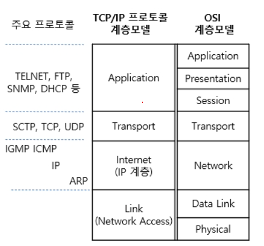

# Chapter 2. 네트워크

## Section1: 네트워크의 기초

### 네트워크의 기초

네트워크: 노드와 링크가 서로 연결되어 있고 리소스를 공유하는 집합을 의미
노드: 서버, 라우터, 스위치 등 네트워크 장치를 위미
링크: 무선 또는 유선

### 2.1.1 처리량과 지연 시간

1)많은 처리량을 처리하고 2)지연 시간이 짧고 3)장애 빈도가 적고 4)좋은 보안을 갖추면 좋은 네트워크라고 할 수 있다

처리량: 링크를 통해 전달되는 단위 시간당 데이터 양. 단위는 bps(초당 전송 또는 수신되는 비트 수)

지연 시간: 요청이 처리되는 시간, 어떤 메시지가 두 장치 사이를 왕복하는 데 걸린 시간. 메체 타입(무선, 유선), 패킷 크기, 라우터의 패킷 처리 시간에 영향을 받음

### 2.1.2 네트워크 토폴로지와 병목 현상

네트워크 토플로지(network topology): 노드와 링크가 어떻게 배치되어 있는지에 대한 방식이자 연결 형태

### 트리 토폴로지

개념: 계층형 토플로지, 트리 형태로 배치한 네트워크 구성을 말함
장점: 노드의 추가, 삭제가 쉬움,
단점: 특정 노드에 트래픽이 집중되면 하위 노드에 영향을 끼친다

### 버스 토폴로지

개념: 중앙 통신 회선 하나에 여러 개의 노드가 연결되어 공유하는 네트워크,근거리 통신망(LAN) 에서 사용 [근거리 통신망이란](https://coding-factory.tistory.com/341)
장점: 설치 비용이 적고 신뢰성이 우수하다. 중앙 통신 회선에 노드를 추가하거나 삭제하기 쉽다
단점: 스푸핑이 가능한 문제점이 있다
스푸핑: 송신부의 패킷이 올바른 수신부로 가지 않게 마비시커나, 악의적인 노드로 해당 패킷이 오도록 처리하는 것

### 스타 토폴로지

개념: 중앙에 있는 노드에 모두 연결된 네트워크 구성
장점:

- 노드를 추가하거나 에러 탐지가 쉽다
- 패킷 충돌 발생 가능성이 적다
- 어떠한 노드에 장애가 발생해도 에러를 발견할 수 있다
- 장애 노드가 중앙 노드가 아니면 다른 노드에 영향을 끼치는 것이 적다

단점:

- 중앙 노드에 장애가 발생하면 전체 네트워크를 사용할 수 없다
- 설치 비용이 고가다

### 링형 토폴로지

개념: 각각의 노드가 양 옆의 두 노드와 연결하여 전체적으로 고리처럼 하나의 연속된 길을 통해 통신을 하는 망 구성 방식
장점:

- 노드 수가 증가되어도 네트워크 상의 손실이 거의 없다.
- 충돌이 발생되는 가능성이 적고 노드의 고장 발견을 쉽게 찾을 수 있다.

단점: 네트워크 구성 변경이 어렵고 회선 장애가 발생하면 전제 네트워크에 영향을 끼칠 수 있다.

### 메시 토폴로지

개념: 망형 토폴로지, 그물망처럼 연결되어 있는 구조
장점: 한 단말 장치에 장애가 발생해도 여러 개의 경로가 존재하므로 네트워크를 계속 사용할 수 있고 분산 처리가 가능함
단점: 노드 추가가 어렵도 구축 비용과 운용 비용이 고가이다

### 병목 현상

> 병목 현상
> 병의 목 부분처럼 넓은 길이 갑자기 좁아짐으로써 대표적으로 교통 정체 현상, 컴퓨터 성능 저하 현상을 예로 들 수 있습니다.
> 컴퓨터 성능 저하 현상은 엄청난 양의 데이터를 순식간에 내보내더라도 메모리가 이를 제대로 소화하지 못해 성능이 떨어지는 현상을 예로 들 수 있습니다.

네트워크 구조(토폴로지)가 중요한 이유는 병목 현상을 찾을 떄 중요한 기준이 되기 때문이다.
관리자는 네트워크 토폴로지를 확인하고 <b>서버와 서버 간</b> 혹은 <b>게이트웨이로 이어지는 회선</b>을 추가해서 병목 현상을 해결한다.

### 2.1.3 네트워크 분류

<b>규모</b>를 기반으로 분류한다.

LAN(Local Area Network): 근거리 통신망, 같은 건물이나 캠퍼스 같은 좁은 공간에서 운영됨. 전송 속도가 빠르고 혼잡하지 않다.
MAN(Metropolitan Area Network): 대도시 지역 네트워크를 나타내며 도시 같은 넓은 지역에서 운영됨. 전송 속도는 평균, LAN 보다 혼잡하다.
WAN(Wide Area Network): 광역 네트워크. 국가 또는 대륙 같은 더 넓은 지역에서 운영. 전송 속도는 낮고 MAN 보다 혼잡하다.

### 2.1.4 네트워크 성능 분석 명령어

### 2.1.5 네트워크 프로토콜 표준화

네트워크 프로토콜: 다른 장치들끼리 데이터를 주고 받기 위해 설정된 공통된 인터페이스. 이는 개인이나 기업이 정하는 것이 아니다. IEEE 또는 IETF 라는 표준화 단체가 정함

Ex) 유선 LAN 프로토콜, HTTP 웹 프로토콜

## Section2: TCP/IP 4계층 모델

인터넷 프로토콜 스위트(internet protocol suite): 인터넷에서 컴퓨터들이 서로 정보를 주고 받는데 쓰이는 프로토콜의 집합. TCP/IP 4계층 모델 혹은 OSI 7계층으로 모델로 설명됨.

### 2.2.1 계층

특징:

- OSI계층은 TCP/IP 계층의 애플리케이션 계층을 세계의 계층으로 나눈다(애플리케이션 계층, 프레젠테이션 계층, 세션 계층)

- 링크 계층을 데이터링크, 물리 계층으로 나눈다
- 특정 계층이 변경되었을 때 다른 계층이 영향을 받지 않도록 설계되어있다.
  ex) 전송 계층에서 TCP가 UDP로 변경했다고 인터넷 웹 브라우저를 다시 설치해야 하는 것이 아니다.

### 애플리케이션 계층

- 응용 프로그램들이 사용되는 프로토콜 계층
- 웹 서비스, 이메일 등 서비스를 실질적으로 사람들에게 제공하는 층

> FTP(File Transfer Protocol) : 장치와 장치 간의 <b>파일</b>을 전송하는데 사용되는 표준 통신 프로토콜 [FTP 프로그램 예](https://chocoball3.tistory.com/167)

> SSH(Secure SHell): 보안되지 않는 네트위크에서 네트워크 서비스를 안전하게 운영하기 위한 암호화 네트워크 프로토콜
>  [ssh란?](https://velog.io/@hyeseong-dev/%EB%A6%AC%EB%88%85%EC%8A%A4-ssh%EB%9E%80)

> HTTP(Hyper Text Transfer Protocol): 인터넷에서 데이터를 주고 받을 수 있는 프로토콜
> [HTTP란?](https://www.zerocho.com/category/HTTP/post/5b344f3af94472001b17f2da)

> SMTP(Simple Mail Transfer Protocol): 전자 메일 전송을 위한 인터넷 표준 통신 프로토콜 [SMTP를 알아보자](https://mutpp.tistory.com/4)

> DNS(Domain Name System): 도메인 이름(www.naver.com)을 실제 IP 주소(222.111.222.111)를 매핑해주는 서버
> [DNS란](https://hanamon.kr/dns%EB%9E%80-%EB%8F%84%EB%A9%94%EC%9D%B8-%EB%84%A4%EC%9E%84-%EC%8B%9C%EC%8A%A4%ED%85%9C-%EA%B0%9C%EB%85%90%EB%B6%80%ED%84%B0-%EC%9E%91%EB%8F%99-%EB%B0%A9%EC%8B%9D%EA%B9%8C%EC%A7%80/)

### 전송 계층

- 송신자와 수신자를 연결하는 통신 서비스를 제공
- 애플리케이션과 인터넷 계층 사이의 데이터가 전달 될 때 중계 역할을 함
- ex)TCP, UDP [TCP와 UDP의 특징 및 차이점 알아보기](https://dev-coco.tistory.com/144)

TCP:

- 패킷 순서를 보장하고
- 연결 지향적 프로토콜이다(서버와 클라이언트가 연결된 상태에서 데이터를 주고 받는다)
- 신뢰성을 구축해서 수신 여부를 확인하고
- '가상회선 패킷 교환 방식'을 사용한다
- 3-way handshaking 과정을 통해 연결을 설정하고, 4-way handshaking 과정을 통해 연결을 해제한다

UDP:

- 순서를 보장하지 않고
- 비연결형 프로토콜이다
- 수신 여부를 확인하지 않고
- 단순히 데이터만 주는 '데이터그램 패킷 교환 방식'을 사용한다
- 신뢰성보다 연속성이 중요한 실시간 스트리밍과 같은 서비스에서 사용된다

### 인터넷 계층

- 장치로부터 받은 네트워크 패킷을 IP주소로 지정된 목적지로 전송하기 위해 사용되는 계층

- Ex) IP, ARP, ICMP
- 상대방이 제대로 받았는지에 대해 보장하지 않은 비연결형적인 특징을 가짐

### 링크 계층(네트워크 접근 계층)

- 실질적으로 데이터를 전달하며 장치 간에 신호를 주고 받는 '규칙'을 정하는 계층
- Ex) 전선, 광성유, 무선
- 데이터 링크 계층과 물리 계층으로 나눌 수 있다

### 물리 계층

무선 LAN과 유선 LAN을 통해 0과 1로 이루어진 데이터를 보내는 계층

<b>유선 LAN(IEEE802.3)</b>

- 전이중화 통신을 사용

  - 전이중화 통신(full duplex): 양쪽 장치가 동시에 송수신할 수 있는 방식. 현대 고속 이더넷을 이 방식을 사용

> CSMA/CD
>
> - 반이중화 통신 중 하나
> - 데이터를 보낸 이후 충동이 발생한다면 일정 시간 이후 재전송하는 방식
> - 수신로와 송신로를 각각 둔것이 아니라 한 경로를 기반으로 데이터를 보내기 때문에 데이터를 보낼 때 충돌에 대해 대비해야 하기 때문

- 유선 LAN을 이루는 케이블

1. 트위스트 페어 케이블: 여덟 개의 구리선을 두 개씩 꼬아서 묶은 케이블을 지칭
   
   [(사진) LAN 케이블과 RJ-45 커넥터]
    

2. 광섬유 케이블:

- 레이저를 이용해 통신해서 구리선 보다 장거리 및 고속 통신이 가능
- 보통 100Gbps의 데이터를 전송
- 광섬유 내부와 외부를 다른 밀도를 가지는 유리나 플라스틱 섬유로 제작해서 한 번 들어간 빛이 내부에서 계속적으로 반사하면서 전진하여 반대편 끝까지 가는 원리
- 코어(core): 굴절률이 높은 부분, 클래딩(cladding): 낮은 부분

<b>무선 LAN(IEEE802.11)</b>

- 반이중화 통신 사용
  - 반이중화 통신(half duplex): 양쪽 장치가 서로 통신 할 수 있지만, 동시에는 통신 할 수 없고 한번에 한 방향만 통신 가능
  - 두 장치가 동시에 충돌하면 메시지가 손실되거나 왜곡될 수 있어 충동 방지 시스템이 필요

> CSMA/CA
>
> - 장치에서 데이터를 보내기 전에 캐리어 감지 등으로 충돌 방지 시스템 작용
>
> 1. 데이터를 송신하기 전에 무선 매체 살핌
> 2. 캐리어 감지
> 3. IFS: 랜덤 값을 기반으로 정해진 시간만큼 기다리며, 만약 무선 매체가 사용중이면 점차 그 간격을 늘려가며 기다림
> 4. 이후에 데이터를 송신

- 무선 LAN을 이루는 주파수

  - 공기에 주파수를 쏘아 무선통신망을 구축
  - 2.4GHz 대역: 장애물에 강한 특성을 가지지만 전제렌인지, 무선 등 전파 간섭이 일어남
  - 5 GHz 대역: 사용할 수 있는 채널 수도 많고, 동시에 사용할 수 있어 상대적으로 깨끗한 전파 환경을 구축. 5GHz 대역을 사용하는 것이 좋음

  - 와이파이: 전자기기들이 무선 LAN신호에 연결 할 수 있게 하는 기술. 사용하려면 AP(Access Point= 공유기)가 있어야됨. 이는 유선 LAN에 흐르는 신호를 무선 LAN 신호로 바꿔줌.  

  - BBS(Basic Service Set): BBS 내에 있는 AP들과 장치들이 서로 통신이 가능한 구조 제공. 근거리 무선 통신

  - ESS(Extended Service Set): 하나 이상의 연결된 BBS 그룹. 장거리 무선 통신 제공, 가용성과 이동성 지원.

### 데이터 링크 계층

'이더넷 프레임'을 통해 에러 확인, 흐름 제어, 접근 제어를 담당하는 계층

[이더넷 프레임](https://blog.naver.com/PostView.nhn?blogId=joo1020_kr&logNo=221471086900&parentCategoryNo=&categoryNo=29&viewDate=&isShowPopularPosts=false&from=postView)

### 계층 간 데이터 송수신 과정

컴퓨터에서 다른 컴퓨터로 데이터를 요청한다면 어떤 과정일까?
Ex) HTTP를 통해 웹 서버에 있는 데이터를 요청하면?

애플리케이션 계층에서 전송 계층으로 보내는 요청 값들이 <b>캡슐화 과정</b>을 거쳐 전달되고, 링크 계층을 통해 해당 서버와 통신 뒤, 해당 서버의 링크 계층에서 애플리케이션 계층까지 <b>비캡슐화 과정</b>을 거쳐 전송됨

### 캡슐화 과정

상위계층의 헤더와 데이터를 하위계층의 데이터 부분에 포함시키고 해당 헤더를 삽입하는 과정

1. 애플리케이션에서 전송 계층으로 전달되면 데이터 + TCP(L4) 헤더 붙여짐(세그먼트 or 데이터그램화)
2. 인터넷 계층으로 전달되면 + IP(L3) 헤더 붙여짐 (패킷화)
3. 링크 계층으로 전달되면 + 프레임 헤더 + 프레임 트레일러가 붙여짐(프레임화)

### 비캡슐화 과정

하위계층에서 상위 계층으로 가며 각 계층의 헤더 부분을 제거하는 가정

캡슐화된 데이터를 받게 되면 링크계층부터 타고 올라가면서 프레임화 -> 패킷화 -> 세그먼트,데이터그램화 ->메시지화
최종적으로 사용자에게 애플리케이션의 PDU인 메시지로 전달됨

### 2.2.2 PDU

네트워크의 어떠한 계층에서 계층으로 데이터가 전달될 때 한 덩어리의 단위를 PDU(Protocol Data Unit)라고 한다.
PDU = 헤더(제어 관련 정보들) + 페이로드(데이터), 이는 계층마다 부르는 명칭이 다르다.

애플리케이션 계층: 메시지

- http의 헤더는 문자열을 기반으로 송수신 하는 데 이는 헤더에 authorization값 등 다른 값들을 넣는 확장이 쉽기 때문

전송 계층: 세그먼트(TCP),데이터그램(UDP)
인터넷 계층: 패킷
링크 계층: 프레임(데이터 링크 계층), 비트(물리 계층)

## Section3: 네트워크 기기

네트워크는 여러개의 기기를 기반으로 구축한다

### 2.3.1 네트워크 기기의 처리 범위

상위계층을 처리하는 기기는 하위계층을 처리할 수 있지만 그 반대는 불가하다

애플리케이션 계층:L7 스위치
인터넷 계층: 라우터, L3 스위치
데이터 링크 계층: L2 스위치,브리지
물리 계층: NIC, 리피터, AP

### 2.3.2 애플리케이션 계층을 처리하는 기기

#### L7 스위치

스위치: 1)여러 장비를 연결하고 2)데이터 통신을 중재하고 3)목적기가 연결된 포트로만 신호를 보내 데이터를 전송하는 통신 네트워크 장비

#### L7 스위치와 L4 스위치 차이

L7 스위치

- 로드 밸런서(서버의 부하를 분산하는 기기)
- 글라이언트로 부터 오는 요청들을 뒤쪽의 여러 서버로 나누는 역할을 하며 트래픽 증가를 목표로 함
- L7 로드밸랜서는 <b>URL, HTTP 헤더, 쿠기</b> 등을 기반으로 트래픽을 분산함
- 필터링, 응용 프로그램 수준의 트래픽 모니터링
- AWS에서 ALB 컴포넌트(Application Load Balancer)로 L7 스위치를 이용한 로드밸런싱을 함

L4 스위치

- 전송 계층을 처리하는 기기
- 스트리밍 관련 서비스에서는 사용할 수 없으며 IP 와 포트 기반으로 트래픽을 분산함
- AWS에서 NLB 컴포넌트(Network Load Balancer)로 L4 스위치를 이용한 로드밸런싱을 함

#### 헬스 체크

- L4 와 L7 스위치 모두 헬스 체크를 통해 정상과 비정상 서버를 판별
- 전송 주기와 재전송 횟수를 설정한 뒤 이후 반복적으로 서버에 요청을 보내는 것
- TCP, HTTP등 다양한 방법으로 요청을 보내며 이 요청이 정상적으로 이루어졌다면 정상적인 서버로 판별
- Ex) TCP요청을 보냈는데 3-웨이 핸드쉐이크가 정상적으로 일어나지 않으면 비정상 서버로 판별

#### 로드밸런서를 이용한 서버 이중화

- 2대 이상의 서버를 기반으로 가상 IP를 제공하고 하나의 서버가 장애가 발생하면 다른 서버로 서빙한다

### 2.3.3 인터넷 계층을 처리하는 기기

#### 라우터

- 다른 네트워크에 존재하는 장치끼리 서로 데이터를 주고 받을때 패킷 소모를 최소화하고 경로를 최적화하여 최소 경로로 포워딩 하는 라우팅 장비

#### L3 스위치

- L2 스위치 기능과 라우팅 기능을 갖춘 장비
- 라우터는 소프트웨어 기반의 라우팅과 하드웨어 기반의 라우팅이 존재하는 하드웨어 기반 라우팅을 담당하는 장치이다

### 2.3.4 데이터링크 계층을 처리하는 기기

#### L2 스위치

- 연결된 장치로부터 패킷을 왔을 때 패킷 전송을 담당
- 패킷의 MAC 주소를 읽어 스위칭하는 역할
- MAC 주소를 MAC 주소 테이블을 통해 관리
- 목적지가 MAC주소 테이블에 없다면 전체 포트에 전달하고 MAC주소 테이블의 주소는 일정 시간 이후 삭제함

#### 브리지

- 두개의 근거리 통신망 (LAN)을 상호 접속 할 수 있도록 하는 통신망 연결 장치
- 포트와 포트 사이의 다리 역할
- 통신망 범위를 확장하고 서로 다른 LAN 등으로 이루어진 하나의 통신망을 구축할 때 쓰임

### 2.3.4 물리 계층을 처리하는 기기

#### NIC

- LAN 카드라고도 함
- 네트워크와 빠른 속도로 데이터를 송수신 할 수 있도록 컴퓨터 내에 설치하는 확장 카드
- LAN 카드에 주민번호처럼 각각을 식별하기 위한 MAC 주소가 있음

#### 리피터

- 약해진 신호를 증폭하여 다른 쪽으로 전달 하는 장치
- 이를 통해 패킷이 더 멀리 나갈 수 있다
- 광케이블이 보급되면서 잘 사용하지 않는 장치가 됨

#### AP(Access Point)

- 패킷을 복사하는 기기
- AP에 유선 LAN을 연결한 후 다른 장치에서 무선 LAN기술을 사용하여 무선 네트워크를 연결 할 수 있다

## Section4: IP 주소

### 2.4.1 ARP(Address Resolution Protocol)

가상 주소인 IP주소를 실제 주소인 MAC주소로 변환해준다
이를 반대로 해주는 것을 RARP

1. A가 ARP Request 브로드캐스트를 보내서 IP주소 120.70.80.3 에 해당하는 MAC주소를 찾는다
2. 해당 주고에 맞는 장치 B가 ARP reply 유니캐스트를 통해 MAC 주소를 반환하는 과정을 거쳐 IP주소에 맞는 MAC주소를 찾음

브로드캐스트: 송신 호스트가 전송한 데이터가 네트워크에 연결된 모든 호스트에 전송되는 방식
유니캐스트: 고유 주소로 식별된 하나의 네트워크 목적지에 1:1로 데이터를 전송하는 방식

### 2.4.2 홉바이홉 통신

통신 장치에 있는 '라우팅 테이블'의 IP를 통해 시작 주소부투 다음 IP로 계속 이동하는 라우팅 괒어을 거쳐 패킷이 최종 목적지에 도달 하는 통신

라우팅: IP주소를 찾아가는 과정

#### 라우팅 테이블

- 라우터에 들어가 있는 목적지 정보들과 그 목적지로 가기 위한 방법들이 있는 리스트
- 게이트웨이와 다음 라우터의 정보를 가지고 있다
  
  [(사진)윈도우로 확인한 라우팅 테이블]

#### 게이트웨이

- 서로 다른 통신망,프로토콜을 사용하는 네트웨크 간의 통신을 가능하게 하는 관문 역할을 하는 컴퓨터나 소프트웨어를 두로 일컫는 용어
- 서로 다른 네트워크상의 통신 프로토콜을 변환해주는 역할

### 2.4.3 IP 주소 체계

#### IPv4

32비트를 8비트 단위로 점을 찍어 표기 ex) 123.45.67.89

#### IPv6

64비트를 16비트 단위로 점을 찍어 표기 ex)2001:db8::ff00:42:8329
요즘 가장 많이 쓰이는 추세이다

#### 클래스 기반 할당 방식

IP 주소 체계는 과거를 거쳐 발전해오고 있으며 처음에는 A, B, C, D, E 다섯 개의 클래스로 구분하는 클래스 기반 할당 방식(CIDR)을 썼음. 앞에 있는 부분을 네트워크 주소, 그 뒤에 있는 부분을 컴퓨터에 부여하는 주소인 호스트 주소로 놓아서 사용.

클래스 A·B·C는 일대일 통신으로 사용되고 클래스 D는 멀티캐스트 통신, 클래스 E는 앞으로 사용할 예비용으로 쓰는 방식

ex)
예를 들어 클래스 A의 경우 0.0.0.0부터 127.255.255.255까지 범위를 갖는다.

첫 번째 주소: 네트워크 구별 주소
마지막 주소: 네트위크에 속해 있는 모든 컴퓨터에 데이터를 보내는 브로드캐스트 주소
그외: 컴퓨터에 부여할 수 있는 호스트 주소

단점: 사용하는 주소보다 버리는 주소가 많아 이를 해소하기 위해 DHCP 와 IPv6, NAT가 나옴

#### DHCP(Dynamic Host Configuration Protocol)

- 네트워크 장치의 IP주소를 수동으로 설정할 필요없이 인터넷에 접속할 때마다 자동으로 IP주소를 할당하게 해줌
- 가정용 네트워크에서 이를 이용해 IP주소를 할당함

#### NAT(Network Address Translation)

- 패킷이 라우팅 장치를 통해 전송되는 동안 IP주소 정보를 수정하여 IP 주소를 다른 주소로 매핑하는 방법
- IPv4 주소로는 많은 주소를 감당하지 못하는 데 이를 해결하기 위해 사설 IP와 공인 IP로 나눠서 많은 주소를 처리
- NAT 장치가 사설 IP를 공인 IP로 변환해줌

보안:
내부 네트워크에서 사용하는 IP주소와 외부에 드러나는 IP주소가 다르게 유지되어 내부 네트워크에 대한 어느 정도 보안이 가능해짐

단점: 여러명이 동시에 인터넷을 접속하게 되므로 실제 접속하는 호스트가 늘수록 접속 속도가 느려진다

### 2.4.4 IP 주소를 이용한 위치 정보

IP주소 = 인터넷에서 사용하는 네트워크 주소이다
동 또는 구까지 위치 추적이 가능하다

## Section5: HTTP

애플리케이션 계층에서 웹 서비스 통신에 사용

### 2.5.1 HTTP/1.0

- 한 연결당 하나의 요청을 처리하도록 설계
- <b>단점:</b> 서버로 부터 파일을 가져올 때 마다 TCP-3웨이 핸드셰이크를 계속 열어야되서 RTT가 증가한다
- RTT: 패킷이 목적지에 도달하고 다시 출발지 까지 돌아오기까지 걸리는 시간(=패킷 왕복 시간)

> <b>RTT 증가를 해결하기 위한 방법</b>
>
> #### 이미지 스플릿팅
>
> 이미지가 합쳐 있는 하나의 이미지를 다운로드하고, 이를 기반으로 background-image의 position을 이용하여 이미지를 표기하는 방법
>
> #### 코드압축
>
> 개행 문자, 빈칸을 없애서 코드의 크기를 최소화하는 방법
>
> #### 이미지 Base64 인코딩
>
> 이미지 파일을 64진법으로 이루어진 문자열로 인코딩하는 방법. 이 방법을 사용하면 서버와의 연결을 열고 이미지에 대해 서버에 HTTP 요청을 할 필요가 없다는 장점이 있다.

### 2.5.2 HTTP/1.1

- 매번 TCP 연결을 하는 것이 아니라 한 번 TCP 초기화를 한 이후에 keep-alive라는 옵션으로 여러 개의 파일을 송수신 할 수 있게 하는 방식
- 한번 TCP 3-웨이 핸드쉐이크가 발생하면 그 다음부터 발생하지 않음
- <b>단점:</b> 문서 안에 다수의 리소스(이미지, css 파일, script 파일)을 처리하려면 요청할 리소스 개수에 비례해서 대기 시간이 길어진다

> #### HOL Blocking(Head of Line Blocking)
>
> 같은 큐에 있는 패킷이 그 첫 번째 패킷에 의해 지연될 때 발생하는 성능 저하 현상
>
> #### 무거운 헤더 구조
>
> 헤더에는 쿠키등 많은 메타데이터가 들어 있고 압축이 되지 않아 무겁다

### 2.5.2 HTTP/2

- HTTP/1.x 보다 지연시간을 줄이고 응답시간을 빠르게 한다

> #### 멀티플랙싱
>
> - 여러 개의 스트림을 사용하여 송수신하는 것
> - 특정 스트림의 패킷이 손실되어도 해당 스트림에만 영향을 미치고 나머지 스트림을 멀쩡하게 동작한다
> - 단일 연결을 사용하여 병렬로 여러 요청을 받을 수 있어 HTTP/1.x에서 발생하는 HOL Blocking을 해결 할 수 있다
>
> #### 헤더 압축
>
> 허프만 코딩 압축 알고리즘을 사용하는 HPACK 압축 형식을 통해 HTTP/1.x의 무거운 헤더를 해결
> 허프만 코딩: 문자열을 문자 단위로 쪼개 빈도수를 세어 빈도가 높은 정보는 적은 비트 수를 사용하고, 빈도가 낮은 정보는 비트 수를 많이 사용하여 전체 데이터 표현에 필요한 비트양을 줄이는 원리이다
>
> #### 서버 푸시
>
> - 클라이언트 요청 없이 서버가 바로 리소스를 푸시할 수 있다.
> - Ex) html을 읽으면서 그 안의 css와 js를 서버에서 푸시하여 클라이언트에 먼저 줄 수 있다

### 2.5.4 HTTPS

- 애플리케이션 계층과 전송 계층 사이에 신뢰 계층인 SSL/TLS계층을 넣은 신뢰할 수 있는 HTTP 요청
  => 통신을 '암호화' 한다

#### SSL/TLS

- 전송 계층에서 보안을 제공하는 프로토콜
- 제 3자가 메시지를 도청하거나 변조하지 못하도록 함(인터셉터)
- 보안 세션을 기반으로 데이터를 암호화하며 보안 세션이 만들어질 때 인증 메커니즘, 키 교환 알고리즘, 해싱 알고리즘이 사용됨

#### SEO에도 도움이 되는 HTTPS

- 구글에서 HTTPS서비스를 하는 사이트가 그렇지 않은 사이트보다 SEO 순위가 높다고 발표

> <b>SEO(검색엔진 최적화) 하는 법 </b>
>
> #### 캐노니컬 설정
>
> ` <link rel='canonical' href='https://XXXXXX'>`
>
> #### 메타 설정
>
> html 파일 윗 부분인 메타를 잘 설정
>
> #### 페이지 속도 개선
>
> PageSpeedInsight로 가서 서비스에 대한 리포팅을 주기적으로 받으면 관리하기
>
> #### 사이트 맵 관리
>
> sitemap.xml을 정기적으로 관리하기

#### HTTPS 구축방법

- CA에서 구매한 인증키를 기반으로 HTTPS 서비스를 구축
- 서버 앞단에 HTTPS를 제공하는 로드밸런서를 두기
- 서버 앞단에 HTTPS를 제공하는 CDN을 구축

### 2.5.4 HTTP/3

- QUIC 라는 계층 위에서 돌아가며 TCP기반이 아닌 UDP기반으로 돌아감
- 초기 연결 설정시 지연 시간 감소라는 장점이 있다

#### 초기 연결 설정시 지연 시간 감소

- TCP를 사용하기 않기 때문에 3-웨이 핸드쉐이크 과정을 거치지 않아도 됨
- 첫 연결에 1- RTT만 소요
- 전송한 패킷이 손실되었다면 수신 측에서 에러를 검출하고 수정하는 방식이며 열악한 네트위크 환경에서도 낮은 패킷 손실률을 자랑
