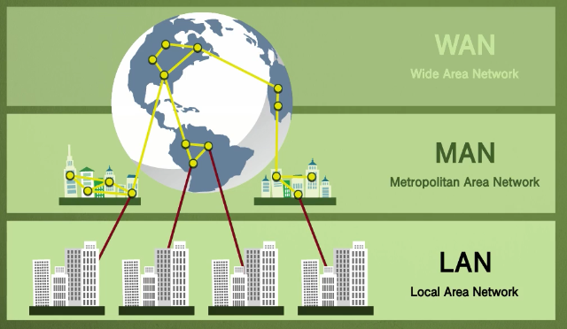
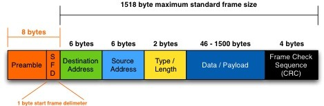

bㅠ# CHAPTER 2. 네트워크

네트워크는 컴퓨터 등의 장치들이 통신 기술을 이용하여 구축하는 연결망을 지칭하는 용어

## SECTION 1. 네트워크의 기초

- 네트워크 : 노드(node)와 링크(link)가 서로 연결되어 있거나 연결되어 있지 않은 집합체
- 노드: 서버, 라우터, 스위치 등 네트워크 장치를 의미하고 링크는 유선 또는 무선을 의미함

### 1.1 처리량과 지연 시간

- 좋은 네트워크 : 많은 처리량, 짧은 지연시간, 적은 장애 빈도, 좋은 보안

- 처리량(throughput)

  - 링크를 통해 전달되는 단위 시간당 데이터양
  - 단위는 bps(bits per second) 초당 전송 또는 수신되는 비트 수
  - 트래픽, 네트워크 장치 간의 대역폭, 네트워크 중간에 발생하는 에러, 장치의 하드웨어 스펙에 영향을 받음

- 지연시간(latency)

  - 요청이 처리되는 시간. 어떤 메시지가 두 장치 사이를 왕복하는 데 걸린 시간
  - 매체 타입(무선, 유선) 패킷 크기, 라우터의 패킷 처리 시간에 영향을 받음

### 1.2 네트워크 토폴로지와 병목 현상

- 네트워크 토폴로지(network topology) : 노드와 링크가 어떻게 배치되어 있는지에 대한 방식이자 연결 형태

> 

> 출처 : https://ko.wikipedia.org/wiki/%EB%84%A4%ED%8A%B8%EC%9B%8C%ED%81%AC_%ED%86%A0%ED%8F%B4%EB%A1%9C%EC%A7%80

- 트리 토폴로지 (Tree)
  - 계층형 토폴로지라고 하며 트리 형태로 배치한 네트워크 구성
  - [장점] 노드의 추가, 삭제가 쉬움
  - [단점] 특정 노드에 트래픽이 집중될 때 하위 노드에 영향을 끼칠 수 있음
- 버스 토폴로지 (Bus)
  - 중앙 통신 회산 하나에 여러 개의 노드가 연결되어 공유하는 네트워크 구성. 근거리 통신망(LAN)에서 사용
  - [장점 1] 설치비용 적고 신뢰성 우수
  - [장점 2] 중앙 통신 회선에 노드를 추가하거나 삭제하기 쉬움
  - [단점] 스푸핑이 가능한 문제점
    (+) 스푸핑은 LAN상에서 송신부의 패킷을 송신과 관련 없는 다른 호스트에 가지 않도록 하는 스위칭 기능을 마비시키거나 속여서 특정 노드에 해당 패킷이 오도록 처리하는 것
- 스타 토폴로지 (Star)
  - 중앙에 있는 노드에 모두 연결된 네트워크 구성
  - [장점 1] 노드를 추가하거나 에러를 탐지하기 쉬우며 패킷의 충돌 발생 가능성이 적음
  - [장점 2] 장애 노드가 중앙 노드가 아닐 경우 다른 노드에 영향을 끼치는 것이 적음
  - [단점 1] 어떠한 노드에 장애가 발생해도 쉽게 에러를 발생할 수 있음
  - [단점 2] 중앙 노드에 장애가 발생하면 전체 네트워크를 사용할 수 없음
  - [단점 3] 설치 비용이 고가
- 링형 토폴로지 (Ring)
  - 각각의 노드가 양 옆의 두 노드와 연결하여 전체적으로 고리처럼 하나의 연속된 길을 통해 통신
  - [장점 1] 노드의 수가 증가되어도 네트워크상의 손실이 거의 없고 충돌이 발생되는 가능성이 적음
  - [장점 2] 노드의 고장을 쉽게 발견할 수 있음
  - [단점] 네트워크 구성 변경이 어렵고 회선에 장애가 발생하면 전체 네트워크에 영향을 크게 끼침
- 메시 토폴로지 (Mesh)
  - 망형 토폴로지. 그물망처럼 연결되어 있는 구조
  - [장점 1] 한 단말 장치에 장애가 발생해도 여러 개의 경로자 존재하므로 네트워크를 계속 사용할 수 있음
  - [장점 2] 트래픽 분산 처리 가능
  - [단점] 노드의 추가가 어렵고 구축 비용과 운용 비용이 고가
  - (+) 완전 메시형(Fully connected mesh topology)과 부분 메시형(Partially connected mesh topology)으로 나뉨
- 병목 현상 (bottleneck)
  - 토폴로지가 중요한 이유는 병목 현상을 찾을 때 중요한 기준이 되기 때문
  - 병목현상이 일어나서 서비스의 지연 시간이 길게 발생했을 때 관리자가 토폴로지를 확인하여 올바르게 해결 가능

### 1.3 네트워크 분류

- ​ 네트워크는 규모를 기반으로 분류

> 

> 출처: https://www.youtube.com/watch?v=Dm8VirVwu-8

- LAN (Local Area Network)
  - 근거리 통신망
  - 같은 건물이나 캠퍼스 같은 좁은 공간에서 운영
  - 전송 속도가 빠르고 혼잡하지 않음
- MAN (Metropolitan Area Network)
  - 대도시 지역 네트워크
  - 도시같은 넓은 지역에서 운영
  - 전송 속도는 평균이며 LAN보다는 더 많이 혼잡
- WAN (Wide Area Network)
  - 광역 네트워크
  - 국가 또는 대륙 같은 더 넓은 지역에서 운영
  - 전송 속도는 낮으며 MAN보다 혼잡

### 1.4 네트워크 성능 분석 명령어

- 네트워크 병목 현상의 주된 원인: 네트워크 대역폭, 네트워크 토폴로지, 서버 CPU 및 메모리 사용량, 비효율적인 네트워크 구성

- ​ 네트워크 관련 테스트와 네트워크와 무관한 테스트를 통해 문제점을 파악하고 네트워크 성능을 분석해봐야 함

- `ping`
  - Packet INternet Groper
  - 네트워크 상태를 확인하려는 대상 노드를 향해 일정 크기의 패킷을 전송하는 명령어
  - 해당 노드의 패킷 수신 상태와 도달하기까지 시간 등을 알 수 있으며 해당 노드까지 네트워크가 잘 연결되어 있는지 확인할 수 있음
  - TCP/IP 프로토콜 중에 ICMP 프로토콜을 통해 동작하므로 ICMP를 지원하지 않는 기기를 대상으로는 실행할 수 없음
  - Ping [IP 주소 또는 도메인 주소]로 실행
- `netstat`
  - 접속되어 있는 서비스들의 네트워크 상태를 표시하는 데 사용
  - 네트워크 접속, 라우팅 테이블, 네트워크 프로토콜 등 리스트를 보여줌
  - 서비스의 포트가 열려 있는지 확인할 때 씀
  - 내가 접속하고 있는 사이트 등에 관한 네트워크 상태 리스트를 볼 수 있음
- `nslookup`
  - DNS에 관련된 내용을 확인하기 위해 쓰는 명령어. 특정 도메인에 매핑된 IP를 확인하기 위해 사용
- `tracert`
  - 윈도우에서는 tracers, 리눅스에서는 traceroute
  - 목적지 노드까지 네트워크 경로를 확인할 때 사용하는 명령어
  - 목적지 노드까지 구간들 중 어느 구간에서 응답 시간이 느려지는지 등을 확인할 수 있음
- `ftp`
  - 대형 파일을 전송하여 테스팅
- `tcpdump`
  - 노드로 오고 가는 패킷을 캡처하는 명령어
- `wireshark`, `netmon`
  - 네트워크 분석 프로그램

### 1.5 네트워크 프로토콜 표준화

- 네트워크 프로토콜 : 다른 장치들끼리 데이터를 주고받기 위해 설정된 공통된 인터페이스
- 기업이나 개인이 아닌 IEEE 또는 IETF라는 표준화 단체가 정함

## SECTION 2. TCP/IP 4계층 모델

- 인터넷 프로토콜 스위트(internet protocol suite): 인터넷에서 컴퓨터들이 서로 정보를 주고받는 데 쓰이는 프로토콜의 집합
- TCP/IP 4계층 모델이나 OSI 7계층 모델로 설명하기도 함
- TCP/IP 4계층 모델: 네트워크에서 사용되는 통신 프로토콜의 집합으로 프로토콜의 네트워킹 범위에 따라 네 개의 추상화 계층으로 구성

### 2.1 계층 구조

- OSI 계층은 애플리케이션 계층을 세 개로 쪼개고 링크 계층을 데이터 링크 계층, 물리 계층으로 나눠서 표현, 인터넷 계층을 네트워크 계층으로 부른다는 점이 다름
- 이 계층들은 특정 계층이 변경되었을 때 다른 계층이 영향을 받지 않도록 설계됨

#### 애플리케이션 계층

- FTP, HTTP, SSH, SMTP, DNS 등 응용프로그램이 사용되는 프로토콜 계층
- 웹 서비스, 이메일 등 서비스를 실질적으로 사람들에게 제공
  - FTP: 장치와 장치 간의 파일을 전송하는 데 사용되는 표준 통신 프로토콜
  - SSH: 보안되지 않은 네트워크에서 네트워크 서비스를 안전하게 운영하기 위한 암호화 네트워크 프로토콜
  - HTTP: World Wide Web을 위한 데이터 통신의 기초, 웹 사이트를 이용하는 데 쓰는 프로토콜
  - SMTP: 전제 메일 전송을 위한 인터넷 표준 통신 프로토콜
  - DNS: 도메인 이름과 IP 주소를 매핑해주는 서버

#### 전송계층

- 송신자와 수신자를 연결하는 통신 서비스를 제공
- 애플리케이션과 인터넷 계층 사이의 데이터가 전달될 때의 중계 역할
- TCP: 패킷 사이의 순서 보장, 가상회선 패킷 교환 방식
- UDP: 순서를 보장하지 않고 수신 여부를 확인하지 않음. 단순히 데이터만 주는 데이터그램 패킷 교환 방식

> **가상회선 패킷 교환 방식**  
> 각 패킷에 가상회선 식별자가 포함. 모든 패킷을 전송하면 가상회선이 해제되고 패킷들은 전송된 순서대로 도착

> **데이터그램 패킷 교환 방식**  
> 패킷이 독립적으로 이동하며 최적의 경로를 선택하여 감. 여러 패킷은 서로 다른 경로로 전송될 수 있으며 도착한 순서가 다를 수 있음

> **TCP 연결 성립 과정**  
>
> - 신뢰성 확보를 위해 3way handshake 진행
> - SYN 단계, SYN + ACK 단계, ACK 단계를 거침

> **TCP 연결 해제 과정**  
>
> - 4 way handshake 과정 발생
> - (+) TIME_WAIT : 소켓이 바로 소멸되지 않고 일정시간 유지되는 상태를 말하며 지연 패킷 등의 문제점을 해결하는데 쓰임

#### 인터넷 계층

- 장치로부터 받은 네트워크 패킷을 IP 주소로 지정된 목적지로 전송하기 위해 사용
- IP, ARP, ICMP 등
- 패킷을 수신해야 할 상대의 주소를 지정하여 데이터 전달
- 상대방이 제대로 받았는지 보장하지 않는 비연결형적인 특징

#### 링크 계층

- 전선, 광섬유, 무선 등으로 실질적으로 데이터를 전달하며 장치간에 신호를 주고받을 규칙을 정하는 계층
- 물리 계층, 데이터 링크 계층으로 나누기도 함
- 물리계층: 무선 LAN과 유선 LAN을 통해 0과 1로 이루어진 데이터를 보냄
- 데이터 링크 계층: 이더넷 프레임을 통해 에러 확인, 흐름 제어, 접근 제어 담당
- 유선 LAN
  - 전이중화 통신: 양쪽 장치가 동시에 송수신할 수 있는 방식
  - CSMA/CD: 이전에는 유선 LAN에 반이중화 통신 중 하나인 CSMA/CD 방식 사용. 데이터를 보낸 이후 충돌이 발생한다면 일정 시간 이후 재전송
  - 유선 LAN을 이루는 케이블
    - 트위스트 페어 케이블: 하나의 케이블처럼 보이지만 실제로는 여덟개의 구리선을 두개씩 꼬아서 묶은 케이블
    - 광섬유 케이블: 광섬유로 만든 케이블. 구리선과는 비교할 수 없을만큼의 장거리 및 고속 통신 가능
- 무선 LAN
  - 반이중화 통신: 양쪽 장치는 서로 통신할 수 있지만 동시에는 통신할 수 없으며 한 번에 한 방향만 통신 가능
  - CSMA/CA: 반이중화 통신 중 하나. 장치에서 데이터를 보내기 전에 캐리어 감지 등으로 사전에 가능한 충돌 방지
  - 무선 LAN을 이루는 주파수
    - 2.4G는 장애물에 강하지만 전자레인지, 무선 등 전파 간섭 일어나는 경우 많음
    - 5G는 사용할 수 있는 채널 수도 많고 동시에 사용할 수 있어서 상대적으로 깨끗한 전파 환경
    - 와이파이(wifi): 전자기기들이 무선 LAN 신호에 연결할 수 있게 하는 기술
    - BSS: 기본 서비스 집합. 단순 공유기가 아닌 동일 BSS 내에 있는 AP들과 장치들이 서로 통신 가능
    - ESS: 하나 이상의 연결된 BSS 그룹
- 이더넷 프레임
  : 데이터 링크 계층은 이더넷 프레임을 통해 전달받은 데이터의 에러를 검출하고 캡슐화하여 다음과 같은 구조를 가짐
  > 
  >
  > 출처: https://mintnlatte.tistory.com/356

#### 계층 간 데이터 송수신 과정

- 캡슐화 과정: 상위 계층의 헤더와 데이터를 하위 계층의 데이터 부분에 포함시키고 해당 계층의 해더 삽입하는 과정
- 비캡슐화 과정: 하위 계층에서 상위 계층으로 가며 각 계층의 헤더 부분을 제거하는 과정

### 2.2 PDU

- 네트워크의 어떤 계층에서 계층으로 데이터가 전달될 때 한 덩어리의 단위가 PDU(Protocol Data Unit)
- 제어 관련 정보들이 포함된 헤더, 데이터를 의미하는 페이로드로 구성

  => 계층마다 부르는 명칭이 다름

  - 애플리케이션 계층: 메시지
  - 전송 계층: 세그먼트(TCP), 데이터그램(UDP)
  - 인터넷 계층: 패킷
  - 링크 계층: 프레임(데이터 링크 계층), 비트(물리 계층)

- PDU 중 아래 계층인 비트로 송수신 하는 것이 가장 빠르고 효율성이 높음
- 하지만 애플리케이션 계층에서는 헤더에 authorization 값 등 다른 값들을 넣는 확장을 위해 문자열 기반으로 송수신

## SECTION 3. 네트워크 기기

### 3.1 네트워크 기기의 처리 범위

- 네트워크 기기는 계층별로 처리 범위를 나눌 수 있음
- 상위 계층을 처리하는 기기는 하위 계층을 처리할 수 있지만 그 반대는 불가능

### 3.2 애플리케이션 계층을 처리하는 기기

- L7 스위치: 애플리케이션 계층을 처리하는 기기
- 스위치: 여러 장비를 연결하고 데이터 통신을 중재하며 목적지가 연결된 포트로만 전기 신호를 보내 데이터를 전송
- L7 스위치는 로드밸런스라고도 하며 서버의 부하를 분산한다

#### L4 스위치와 L7 스위치 차이

- 로드밸런서로는 L4 스위치도 있다. L4 스위치는 인터넷 계층을 처리하는 기기로 스트리밍 관련 서비스에서는 사용할 수 없다. IP와 포트를 기반으로 트래픽을 분산
- L7 로드밸런서는 IP, 포트 이외에도 URL, HTTP 헤더, 쿠키 등을 기반으로 트래픽을 분산

#### 헬스 체크

- 헬스체크: 전송 주기와 재전송 횟수 등을 설정한 이후 반복적으로 서버에 요청을 보내는 것

#### 로드밸런서를 이용한 서버 이중화

- 로드밸런서는 대표적인 기능 => 서버 이중화 (서비스를 안정적으로 운영하기 위해 2대 이상의 서버는 필수적)

### 3.3 인터넷 계층을 처리하는 기기

- 인터넷 계층을 처리하는 기기 : 라우터, L3 스위치
- 라우터 : 여러 개의 네트워크를 연결, 구분시켜주는 역할
- L3 스위치 : L2 스위치의 기능과 라우팅 기능을 갖춘 장비로 L3 스위치를 라우터라고 해도 무방함

### 3.4 데이터 링크 계층을 처리하는 기기

- 데이터 링크 계층을 처리하는 기기 : L2 스위치, 브리지
- L2 스위치 : 장치들의 MAC 주소를 MAC 주소 테이블을 통해 관리하며 연결된 장치로부터 패킷이 왔을 때 패킷 전송을 담당
- 브리지 : 두 개의 근거리통신망을 상호 접속할 수 있도록 하는 통신망 연결 장치. 포트와 포트 사이의 다리 역할

### 3.5 물리 계층을 처리하는 기기

- 물리 계층을 처리하는 기기 : NIC, 리피터, AP
- NIC(Network Interface Card) : 2대 이상의 컴퓨터 네트워크를 구성하는 데 사용. 네트워크와 빠른 속도로 데이터를 송수신할 수 있도록 컴퓨터 내에 설치하는 확장 카드
- 리피터(repeater) : 들어오는 약해진 신호 정도를 증폭하여 다른쪽으로 전달하는 장치
- AP(Access Point) : 패킷을 복사하는 기기

## SECTION 4. IP 주소

### 4.1 ARP

- Address Resolution Protocol
- 컴퓨터와 컴퓨터 간의 통신은 IP 주소에서 ARP를 통해 MAC 주소를 찾아 MAC 주소를 기반으로 통신
- ARP는 IP 주소로부터 MAC 주소를 구하는 IP와 MAC 주소의 다리 역할ㅇ르 하는 프로토콜

### 4.2 홉바이홉 통신

- 홉바이홉 통신(hop by hop) : IP 주소를 통해 통신하는 과정
- 홉 : 통신망에서 각 패킷이 여러 개의 라우터를 건너가는 모습을 비유적으로 표현한 것
- 라우팅 테이블 : 송신지에서 수신지까지 도달하기 위해 사용. 라우터에 들어가 있는 목적지 정보들과 그 목적지로 가기 위한 방법이 들어있는 리스트
- 게이트웨이 : 서로 다른 통신망, 프로토콜을 사용하는 네트워크 간의 통신을 가능하게 하는 관문 역할을 하는 컴퓨터나 소프트웨어

### 4.3 IP 주소 체계

- IP 주소 => IPv4와 IPv6
  - IPv4는 32비트를 8비트 단위로 점을 찍어 표기
  - IPv6는 64비트를 16비트 단위로 점을 찍어 표기

#### 클래스 기반 할당 방식 (classful network addressing)

- IP 주소 체계는 처음에는 A, B, C, D, E 다섯 개의 클래스로 구분하는 클래스 기반 할당 방식을 사용
- 앞에 있는 부분을 네트워크 주소, 그 뒤에 있는 부분을 컴퓨터에 부여하는 주소인 호스트 주소로 놓아서 사용
- [단점] 사용하는 주소보다 버리는 주소가 많음

#### DHCP (Dynamic Host Configuration Protocol)

- 네트워크 장치의 IP 주소를 수동으로 설정할 필요 없이 인터넷에 접속할 때마다 자동으로 할당
- 많은 라우터와 게이트웨이 장비에 DHCP 기능이 있으며, 이를 통해 대부분의 가정용 네트워크에서 IP 주소를 할당

#### NAT (Network Address Translation)

- 패킷이 라우팅 장치를 통해 전송되는 동안 패킷의 IP 주소 정보를 수정하여 IP 주소를 다른 주소로 매핑하는 방법
- [장점] 여러 대의 호스트가 하나의 공인 IP 주소를 사용하여 인터넷에 접속할 수 있음
- [단점] 호스트 숫자에 따라서 접속 속도가 느려질 수 있음

### 4.4 IP 주소를 이용한 위치 정보

- IP 주소는 인터넷에서 사용하는 네트워크 주소기이 때문에 이를 통해 동 또는 구까지 위치 추적이 가능

## SECTION 5. HTTP

### 5.1 HTTP/1.0

- HTTP/1.0은 기본적으로 한 연결당 하나의 요청을 처리하도록 설계 => 이는 RTT 증가를 불러옴
  > RTT : 패킷이 목적지에 도달하고 나서 다시 출발지로 돌아오기까지 걸리는 시간이며 패킷 왕복시간

#### RTT의 증가를 해결하기 위한 방법

- 이미지 스플리팅, 코드 압축, 이미지 Base64 인터딩을 사용
- 이미지 스플리팅: 이미지가 합쳐 있는 하나의 이미지를 다운로드 받고 이를 기반으로 백그라운드 이미지의 포지션을 이용하여 이미지를 표기하는 방법
- 코드압축: 코드를 압축해서 개행 문자, 빈칸을 없애서 코드의 크기를 최소화하는 방법
- 이미지 Base64 인코딩: 이미지 파일을 64진법으로 이루어진 문자열로 인코딩하는 방법

### 5.2 HTTP/1.1

- 매번 TCP 연결을 하는 것이 아니라 한번 TCP 초기화를 한 이후에 keep-alive 라는 옵션으로 여러 개의 파일을 송수신할 수 있게 바뀜
- HOL Blocking: 네트워크에서 같은 큐에 있는 패킷이 그 첫번째 패킷에 의해 지연될 때 발생하는 성능 저하 현상
- 무거운 헤더구조: 헤더에 쿠키 등 많은 메타데이터가 들어 있고 압축이 되지 않아 무거움

### 5.3 HTTP/2

- 지연시간을 줄이고 응답 시간을 더 빠르게 할 수 있으며 멀티플렉싱, 헤더압축, 서버 푸시, 요청의 우선순위 처리를 지원하는 프로토콜
- 멀티플렉싱: 여러 개의 스트림을 사용하여 송수신 하는 것. 특정 스트림의 패킷이 손실되어도 해당 스트림에만 영향을 미침
- 헤더 압축: 허프만 코딩 압축 알고리즘을 사용하여 헤더를 압축시킴
- 서버 푸시: 클라이언트의 요청 없이 서버가 바로 리소스를 푸시 가능

### 5.4 HTTPS

- 애플리케이션 계층과 전송 계층 사이에 신뢰 계층인 SSL/TLS 계층을 넣은 신뢰할 수 있는 요청. 이를 통해 통신을 암호화 함
- SSL/TLS: 전송 계층에서 보안을 제공하는 프로토콜. 클라이언트와 서버가 통신할 때 제3자가 메시지를 도청하거나 변조하지 못하도록 함
- 보안세션: 보안이 시작되고 끝나는동안 유지되는 세션
- 사이퍼 슈트: 프로토콜, AEAD 사이퍼 모드, 해싱 알고리즘이 나열된 규약
- 인증 메커니즘: CA에서 발급한 인증서를 기반으로 이루어짐. CA에서 발급한 인증서는 공개키를 클라이언트에 제공하고 사용자가 접속한 서버가 신뢰할 수 있는 서버임을 보장
- 인증서는 서비스 정보, 공개키, 지문, 디지털 서명 등으로 이루어져 있음
- CA 발급 과정: 자신의 서비스가 CA 인증서를 발급받으려면 자신의 사이트 정보와 공개키를 CA에 제출해야 함. 이후 CA는 공개키를 해시한 값인 지문을 사용하는 비밀키 등을 기반으로 인증서를 발급
- 암호화 알고리즘: 키 교환 암호화 알고리즘으로는 ECDHE 또는 DHE를 사용. 둘 다 디퍼-헬만 키 교환 암호화 알고리즘 방식을 근간으로 만들어짐
- 해싱 알고리즘: 데이터를 추정하기 힘든 더 작고, 섞여 있는 조각으로 만드는 알고리즘

#### SEO에도 도움이 되는 HTTPS

- SEO: 검색엔진 최적화 => 사용자들이 구글, 네이버 같은 검색엔진으로 웹 사이트를 검색했을 때 그 결과를 페이지 상단에 노출시켜 많은 사람이 볼 수 있또록 최적화하는 방법을 의미
- 구글은 SSL 인증서를 갖오해왔고, 사이트 내 모든 요소가 동일하다면 HTTPS 서비스를 하는 사이트가 그렇지 않은 사이트보다 SEO 순위가 높을 것이라고 공식적으로 밝힘

#### HTTPS 구축하는 방법 3가지

1. 직접 CA에서 구매한 인증키를 기반으로 구축
2. 서버 앞단의 HTTPS를 제공하는 로드밸런서를 둬서 구축
3. 서버 앞단에 HTTPS를 제공하는 CDN을 둬서 구축

### 5.5 HTTP/3

- TCP 기반이 아닌 UDP 기반으로 돌아감. 멀티플렉싱을 가지고 있으며 초기 연결 설정 시 지연 시간이 감소
- 초기 연결 설정 시 지연 시간 감소 : QUIC는 통신을 시작할때 3-웨이 핸드셰이크 과정을 거치지 않아도 되기 때문
- 순방향 오류 수정 매커니즘이 적용되어 있어 전송한 패킷이 손실되었다면 수신 측에서 에러를 검출하고 수정함
- 열악한 네트워크 환경에서도 낮은 패킷 손실률을 자랑함
