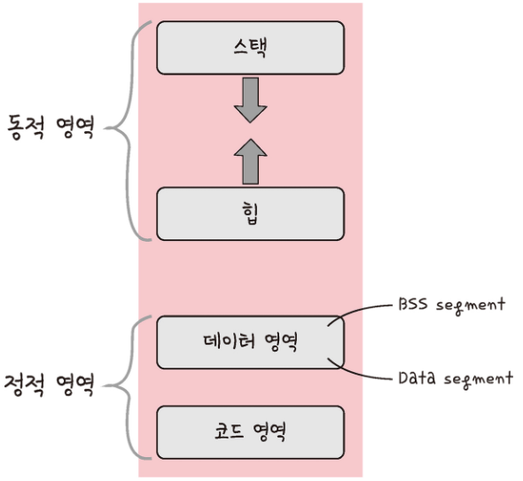

# Chapter 3. 운영체제

## Section1: 운영체제와 컴퓨터

### 3.1.1 운영체제와 역할과 구조

#### 운영체제

- 사용자가 컴퓨터를 쉽게 다루게 해주는 인터페이스
- 한정된 메모리나 시스템 자원을 효율적으로 분배하는 참된 일꾼

#### 운영체제의 역할

- CPU 스케줄링과 프로세스 관리: CPU 소유권을 어떤 프로세스에 할당할지, 프로세스의 생성과 삭제, 자원 할당 및 반환을 관리
- 메모리 관리: 한정된 메모리를 어떤 프로세스에 얼마큼 할당해야 하는지 관리
- 디스트 파일 관리: 디스크 파일을 어떠한 방법으로 보관할지 관리
- I/O 디바이스 관리: 마우스, 키보드와 컴퓨터 간에 데이터 주고 받는 것을 관리

#### 운영체제의 구조

- 운영체제 부분 (GUI/CUI, 시스템콜, 커널, 드라이버)
- GUI: 사용자 인터페이스의 한 형태 (명령어가 아닌 아이콘을 마우스로 클릭하여 상호작용을 도와줌)
- 드라이버: 하드웨어를 제어하기 위한 스프트웨어
- CUI: 명령어로 치는 인터페이스
- I/O 요청: 입출력 함수, 데이터베이스, 네트워크, 파일 접근 등에 관한 일

##### 시스템콜

- 유저 프로그램이 운영체제의 서비스를 받기 위해 커널 함수를 호출할 때 사용

작동 방식: 유저 프로그램이 I/O 요청으로 트랩(trap)을 발동하면 올바른 I/O 요청인지 확인한 후 <b>유저 모드</b>가 시스템콜을 통해 <b>커널 모드</b>로 변환 되어 실행됨.
ex) fs.readFile()
장점: 컴퓨터 자원에 대한 직접 접근을 차단, 다른 프로그램으로부터 보호

- 프로세스나 스레드에서 운영체제로 어떠한 요청을 할 때 시스템콜이라는 인터페이스와 커널을 거쳐 운영체제에 전달됨
- 시스템콜은 추상화 계층이다(네트워크 통신이나 데이터베이스와 같이 낮은 단계의 영역 처리에 대한 부분을 신경쓰지 않고 프로그램을 구현할 수 있다)

> modebit
>
> 
> 시스템콜이 작동될 때 modebit을 참고해서 유저 모드와 커널 모드를 구분한다. I/O 디바이스(카메라, 키보드)는 운영체제를 통해서만 작동해야 된다. 만약 유저 모드 기반으로 카메라가 켜지면, 사용자가 의도하지 않았는데 공격자가 카메라를 갑자기 키는 등 악용할 위험이 있다.
>
> 유저가 카메라를 이용하려고 하면 시스템 콜을 호출하고 modebit을 1에서 0으로 바꾸며 커널 모드로 변경한 후 카메라 자원을 이용한 로직을 수행. 그 이후 modebit을 0에서 1로 바꿔서 유저 모드로 변경한 후 이후 로직을 실행
>
> 유저 모드: 유저가 접근할 수 있는 영역을 제한적으로 두며 컴퓨터 자원에 함부로 침범하지 못하는 모드
> 커널 모드: 모든 컴퓨터 자원에 접근할 수 있는 모드
> 커널: 운영체제의 핵심 부분이자 시스템콜 인터페이스를 제공하며 보안, 프로세스, 파일 시스템, I/O 디바이스, I/O 요청 관리 등 운영체제의 중추적인 역할을 함

### 3.1.2 컴퓨터의 요소

컴퓨터는 CPU, DMA 컨트롤러, 메모리, 타이머, 디바이스 컨트롤러로 이루어져 있음

#### CPU

- 산술논리연산자, 제어장치, 레지스터로 구성되어있다
- 인터럽트에 의해 단순히 메모리에 존재하는 명령어를 해석해서 실행하는 일꾼이다

##### 제어장치(CU, Control Unit)

- 프로세스 조작을 지시하는 장치
- 입출력 장치 간 통신을 제어하고 명령어들을 읽고 해석하며 데이터 처리를 위한 <b>순서를 결정</b>

##### 레지스터

- CPU 안에 있는 매우 빠른 임시기억장치
- CPU는 자체적으로 데이터를 저장할 방법이 없기 때문에 레지스터를 거쳐 데이터를 전달한다

##### 산술논리연산장치

- 산술 연산과 논리 연산을 계산하는 디지털 회로

##### CPU 연산 처리

1.  제어장치가 메모리에 계산할 값을 로드한다. 또한 레지스터에도 로드한다
2.  제어장치가 레지스터에 있는 값을 계산하라고 산술논리연산자에게 명령한다
3.  제어장치가 계산된 값을 다시 '레지스터에서 메모리로' 계산한 값을 저장한다
    <b>비유하자면 (제어장치 - 작업 총괄자),(레지스터- 작업장),(산술논리연산자 - 일꾼) 느낌</b>

##### 인터럽트

- 어떤 신호가 들어올 때 CPU를 잠깐 정지 시키는 것
- 키보드, 마우스 IO 디바이스, 0 으로 숫자를 나누는 산술 연산, 프로세스 오류 등으로 발생
- 인터럽트가 발생하면 인터럽트 핸들러 함수가 모여있는 인터럽트 백터로 가서 인터럽트 핸들러 함수가 실행

하드웨어 인터럽트: IO 디바이스에서 발생하는 인터럽트
소프트웨어 인터럽트: trap, 프로세스 오류등 프로세스가 시스템콜을 호출할 때 발동

##### DMA 컨트롤로

- I/O 디바이스가 메모리에 직접 접근할 수 있도록 하는 하드웨어 장치
- CPU에만 많은 인터럽트가 들어오기 때문에 CPU 부하를 막아주며 CPU의 일을 부담하는 보조 일꾼
- 하나의 작업을 CPU와 DMA 컨트롤러가 동시에 하는 것을 방지

##### 메모리

- 전자회로에서 데이터나 상태, 명령어를 기록하는 장치
- CPU는 계산을 담당, RAM은 기억을 담담
- 메모리가 클수록 많은 일을 동시에 할 수 있다

##### 타이머

- 특정 프로그램에 시간 제한을 다는 역할
- 시간이 많이 걸리는 프로그램이 작동할 떄 제한을 걸기 위해 존재

##### 디바이스 컨트롤로

- 컴퓨터와 연결되어 있는 IO 디바이스들의 작은 CPU

## Section2: 메모리

CPU는 '메모리'에 올라와 있는 프로그램들의 명령어(프로세스)들을 실행 할 뿐

### 3.2.1 메모리 계층

- 레지스터: CPU 안에 있는 작을 메모리, 휘발성, 속도 가장 빠름, 기억 용량이 가장 적다
- 캐시: L1, L2 캐시를 지칭. 휘발성, 속도 빠름, 기억 용량이 적다
- 주기억장치(RAM): 휘발성, 속도 보통, 기억 용량 보통
- 보조기억장치(SSD,HDD): 비휘발성, 속도 낮음, 기억 용량이 많다

RAM

- 하드디스크로 부터 일정량의 데이터를 복사해서 임시 저장하고 이를 필요할 때마다 CPU 빠르게 전달 하는 역할
- 게임 도중 '실행 중' 메시지는 하드디스크 또는 인터넷에서 데이터를 읽어 RAM으로 전송하는 과정이 아직 끝나지 않음을 의미

#### 캐시

- 빠른 장치와 느린 장치에서 속도 차이에 따른 병목 현상을 줄이기 위한 메모리
- 데이터를 접근하는 시간이 오래 걸리는 경우 해결과 무언가를 다시 계산하는 시간을 절약할 수 있다

-> 자주 사용하는 데이터를 캐시에 저장해야 된다? == 지역성

시간 지역성: 최근에 사용한 데이터에 다시 접근하려는 특성
공간 지역성: 최근 접근한 데이터를 이루고 있는 공간이나 가까운 공간에 접근하려는 특성

#### 캐시히트와 캐시미스

<b>캐시히트</b>

- 캐시에서 원하는 데이터를 찾은 경우
- 해당 데이터를 제어장치를 거쳐 가져오개 돔
- CPU 내부 버스를 기반으로 작동하기 때문에 빠르다

<b>캐시미스</b>

- 캐시에서 찾지 못하면 주메모리로 가서 데이터를 찾아오는 경우
- 시스템 버스를 기반으로 작동하기 때문에 느리다

<b>캐시매핑</b>

- 캐시가 히트되기 위해 매핑하는 방법
- CPU의 레지스터와 주 메모리(RAM) 간에 데이터를 주고 받을 때
- 두 장치의 용량 차이가 크기 때문에 작을 레지스터가 캐시 계층으로 역할을 잘 해주려면 매핑 방식이 중요

ex) 직접 매핑, 연관 매핑, 집합 연관 매핑

#### 웹 브라우저의 캐시

사용자의 커스텀한 정보나 인증 모듈 관련 사항들을 웹 브라우저에 저장해서 추후 서버에 요청할 때 자신을 나타내는 아이덴티티 나 중복 요청 방지를 위해 사용

<b>쿠키</b>

- 만료기한이 있는 키-값 저장소
- same site 옵션을 strict로 설정하지 않았을 경우 다른 도메인에서 요청했을 때 자동 전송
- 4KB 까지 데이터 저장 가능
- 쿠기 설정시 document.cookie로 쿠키를 볼 수 없게 httponly 옵션을 거는 것이 중요
- 클라이언트, 서버 동시 만료기한을 정할 수 있는데 보통 서버에서 정함

<b>로컬 스토리지</b>

- 만료기한이 없는 키-값 저장소
- 10MB 까지 데이터 저장 가능
- 웹 브라우저를 닫아도 유지되고 도메인 단위로 저장, 생성 된다
- HTML5를 지원하지 않는 웹 브라우저에서는 사용할 수 없다
- 클라이언트에서만 수정이 가능

<b>세션 스토리지</b>

- 만료기한이 없는 키-값 저장소
- 탭 단위로 세션 스토리지를 생성함
- 탭을 닫을 때는 해당 데이터가 삭제됨
- 5MB 까지 데이터 저장 가능
- HTML5를 지원하지 않는 웹 브라우저에서는 사용할 수 없다
- 클라이언트에서만 수정이 가능

<b>데이터베이스의 캐싱 계층</b>
데이터베이스를 시스템을 구축할 때도 메인 데이터베이스 위에 레디스(Redis)데이터베이스 계층을 '캐싱 계층'으로 둬서 성능을 향상 시킴

### 3.2.2 메모리 관리

운영체제가 메모리 관시를 어떻게 효율적으로 관리할까??

#### 1) 가상 메모리

컴퓨터가 실제로 이용 가능한 메모리 자원을 추상화하여 이를 사용하는 사용자들에게 매우 큰 메모리로 보이게 만드는 것

- 가상으로 주어진 주소를 <b>가상 주소</b>, 실제 메모리상에 있는 주소를 <b>실제 주소</b>하고 함
- <b>가상 주소는 메모리관리장치(MMU)에 의해 실제 주소로 변환</b>되며, 이 덕분에 사용자는 실제 주소를 의식할 필요 없이 프로그램을 구축 할 수 있다
- 가상 메모리는 가상 주소와 실제 주소가 매핑되어 있고 프로세스의 주소 정보가 들어 있는 '페이지 테이블'로 관리

##### 스와핑

- 메모리에서 당장 사용하지 않는 영역을 하드디스크에 옮기고 하드디스크의 일부분을 마치 메모리처럼 불러와 쓰는 것을 스와핑이라고 함
- 가상 메모리에는 존재하지만 실제 메모리인 RAM에는 현재 없는 데이터나 코드에 접근할 경우 페이지 폴트가 발생하는데 스와핑을 통해 페이지 폴트가 일어나지 않는 것 처럼 만듦

> 페이지 폴트(page fault)
>
> - 가상 메모리에는 존재하지만 실제 메모리인 RAM에는 현재 없는 데이터나 코드에 접근할 경우 발생
>
> 1. CPU는 물리 메모리를 확인하여 해당 페이지가 없으면 트랩을 발생항 운영체제에 알림
> 2. 운영체제는 CPU의 동작을 잠시 멈춘다
> 3. 운영체제는 페이지 테이블을 확인하여 가상 메모리에 페이지가 존재하는지 확인하고, 없으면 프로세스를 중단하고 현재 물리 메모리에 비어 있는 프레임이 있는지 찾는다. 물리 메모리에도 없다면 스와핑이 발동
> 4. 비어있는 프레임에 해당 페이지를 로드하고, 페이지 테이블을 최신화 한다
> 5. 중단되었던 CPU를 다시 시작
>
> 패이지: 가상 메모리를 사용하는 최소 크기 단위
> 프레임: 실제 메모리를 사용하는 최소 크기 단위

#### 2) 스레싱

- 페이지 폴트율이 놓은 것을 의미, 컴퓨터의 심각한 성능 저하를 초래
- 메모리에 너무 많은 프로세스가 동시에 올라가면 스와핑이 많이 일어나서 발생
- 페이지 폴트가 일어나면 CPU 이용률이 낮아진다. CPU 이용률이 낮아지게 되면 운영체제는 'CPU가 한가한가?'라고 생각하여 가용성을 더 높이기 위해 더 많은 프로세스를 메모리에 올리게 된다. 이같은 악순환이 반복되며 스레싱이 일어나게 된다.
- 해결 방법: 1) 메모리 늘리기, HDD를 SSD로 교체, 운영체제에서 작업세트와 PFF 방식 사용

작업 세트: 프로세스의 과거 사용 이력인 지역성을 통해 결정된 페이지 집합을 만들어서 미리 메모리에 로드 === 가상 메모리를 미리 실제 메모리에 로드한다

PFF(Page Fault Frequency): 상한선에 도달한다면 프레임을 늘리고 하한선에 도달한다면 프레임을 줄이는 것

#### 3) 메모리 할당

메모리에 프로그램을 할당할 때 시작 메모리 위치, 메모리의 할당 크기를 기반으로 할당하는데 연속 할당과 불연속 할당으로 나뉜다

##### 연속 할당

- 메모리' 공간을 할당하는 것
- 프로세스가 순차적으로 '연속적으로 메모리 공간에 할당 됨
- <b>고정 분할 방식</b>: 메모리를 미리 나누어 관리, 미리 나뉘어 있어 융통성이 없다, 내부 단편화가 발생
- (내부 단편화: 메모리를 나눈 크기보다 프로그램이 작아서 들어가지 못하는 공간이 발생)
- <b>가변 분할 방식</b>: 매 시점 프로그램의 크기에 맞게 동적으로 메모리를 나눠 사용, 내부 단편화 대신 외부 단편화 발생
- (외부 단편화: 메모리를 나눈 크기보다 프로그램이 커서 들어가지 못하는 공간이 발생하는 현상)

> ##### 가변 분할 방식 종류
>
> 최초적합: 위쪽이나 아래쪽부터 시작해서 홀을 찾으면 바로 할당
> 최적적합: 프로세스 크기 이상인 공간 중 가장 작은 홀 부터 할당
> 최악적합: 프로세스 크기와 가장 많이 차이 나는 홀에 할당

##### 불연속 할당

- 현대 운영체게가 쓰는 방법으로 '페이지 기법' 이 있다
- 페이징, 세크멘테이션,페이지드 세그멘테이션

###### 페이지

- 동일한 크기의 페이지 단위로 나누어 메모리의 서로 다른 위치에 프로세스를 할당
- 홀의 크기가 균일하지 않은 문제가 없어진다
- 주소 변환이 복잡해짐

###### 세그멘테이션

- 의미 단위인 세그먼트로 나눈다
- 프로세스(코드,데이터,스택,힙)를 코드와 데이터 기반으로 나눌 수도 있고, 함수 단위로 나눌 수도 있다
- 공유와 보안 측면에서 좋다
- 홀의 크기가 균일하지 않은 문제가 있다

###### 페이지 세그멘테이션

- 공유나 보안을 의미 단위의 세그먼트로 나누고
- 물리적 메모리는 페이지로 나눔

#### 4) 페이지 교체 알고리즘

스와핑을 적게 일어나도록 설계하는 알고리즘

##### 오프라인 알고리즘

- 먼 미래에 참조되는 페이지와 현재 할당하는 페이지를 바꾸는 알고리즘
- 미래에 사용하는 프로세스를 알수 없어서 가장 좋지만 사용할 수 없는 알고리즘
- 다른 알고리즘과의 성능 비교에 대한 기준을 제공

##### FIFO

- 가장 먼저 온 페이지를 교체 영역에 가장 먼저 놓는 방법

##### LRU(Least Recently Used)

- 참조가 가장 오래된 페이지를 바꾼다
- '오래된' 것을 파악하기 위해 각 페이지 마다 계수기,스택을 두어야 하는 문제점이 있다

##### NUR(Not Used Recently)

- LRU에서 발전
- 1: 최근에 참조됨, 0: 참조하지 않음
- 시계 방향으로 돌면서 0을 찾고 0을 찾은 순간 해당 프로세스를 교체하고, 해당 부분을 1로 바꾸는 알고리즘

##### LFU(Least Frequently Used)

- 가장 참조 횟수가 적을 페이지를 교체, 즉 많이 사용되지 않는 것을 교체

## Section3: 프로세스와 스레드

- <b>프로세스</b>: 컴퓨터에서 실행되고 있는 프로그램, CPU의 스케줄링의 대상이 되는 task
- <b>스레드</b>: 프로세스 내 작업의 흐름

프로그램이 메모리에 올라가면 프로세스가 되는 인스턴스화가 일어나고, 운영체제의 CPU스케줄려에 따라 CPU 프로세스를 실행

### 3.3.1 프로세스와 컴파일 과정

- 구글 프로그램(chorme.exe)는 '프로그램', 이를 두 번 클릭해서 실행하면 '프로세스'가 시작됨

- 컴파일 과정: 컴파일러가 프로그램을 컴파일 과정을 거쳐 인간이 이해할 수 있는 언어로 작성된 코드를 기계어로 번역하는 작업

전처리: 소스코드 주석 제거, #include 등 헤더 파일을 병합하여 매크로를 치환
컴파일러: 오류 처리, 코드 최적화 작업을 하며 어셈블리어로 변환함
어셈블러: 어셈블리어는 목적 코드(object code)로 변환됨, 리눅스에서는 확장자가 .o로 바뀜
링커: 프로그램 내에 있는 라이브러리 함수 또는 다른 파일들과 목적 코드를 결합하여 실행 파일을 만듦. 실행 파일의 확장자는 .exe 또는 .out이라는 확장자를 가짐

> <b>정적 라이브러리</b>: 프로그램 빌드 시 라이브러리가 제공하는 모든 코드를 실행 파일에 넣는 방식. 외부 의존도가 낮지만 코드 중복 등 메모리 효율이 떨어진다.
> <b>동적 라이브러리</b>: 프로그램 실행 시 필요한 DLL이라는 함수 정보를 통해 참조하는 방식. 메모리 효율성은 좋지만 외부 의존도가 높다.

### 3.3.2 프로세스의 상태

#### 생성 상태

- 프로세스가 생성된 상태
- fork(), exec() 함수를 통해 생성됨
- fork: 부모의 프로세스의 주소 공간을 그대로 복사,새로운 자식 프로세스를 생성하는 함수. 주소 공간만 복사하고 부모 프로세스의 비동기 작업 등을 상속하지 않는다
- exec: 새롭게 프로세스를 생성하는 함수

#### 대기 상태

- 메모리 공간이 충분하면 메모리를 할당 받고 아니면 아닌 상태로 대기 하고 있으며 CPU 스케줄러로부터 CPU 소유권이 넘어오기를 기다리는 상태

#### 대기 중단 상태

- 메모리 부족으로 일시 중단된 상태

#### 실행 상태

- CPU 소유권과 메모리를 할당 받고 인스트럭션을 수행 중인 상태를 의미

#### 중단 상태

- 어떤 이벤트가 발생한 이유 기다리며 프로세스가 차단된 상태. ex) I/O 디바이스에 의한 인터럽트

#### 일시 중단 상태

- 중단된 상태에서 프로세스가 실행되려고 하지만 메모리 부족으로 일시 중단된 상채

#### 종료 상태

- 메모리와 CPU 소유권을 모두 놓고 가는 상태.
- abort: 부모 프로세스가 자식 프로세스를 강제시키는 비자발적 종료, 자식 프로세스에 할당된 자원의 한계치를 넘어서거나 부모 프로세스가 종료되거나 사용자가 process.kill 등 여러 명열어로 프로세스를 종료할 때 발생

### 3.3.3 프로세스의 메모리 구조

#### 스택

- 지역변수, 매개변수, 함수가 저장되고 컴파일 시에 크기가 결정되며 '동적'인 특징을 가짐

#### 힙

- 동적 할당 할때 사용되며 런타임 시 크기가 결정됨
- 백커 같은 동적 배열은 힙에 동적 할당 됨

#### 데이터 영역

- 전역변수, 정적변수가 저장되고 정적인 특징을 갖는 프로그램이 종료되면 사라지는 변수가 들어있는 영역

- BSS 영역과 Data 영역으로 나뉘고, BSS 영역은 초기화가 되지 않은 변수가 0으로 초기화되어 저장되며 Data 영역은 0이 아닌 다른 값으로 할당된 변수들이 저장된다

#### 코드 영역

- 프로그램이 내장되어 있는 소스 코드가 들어가 있는 영역
- 수정이 불가능한 기계어로 저장되면 정적인 특징을 가짐

### 3.3.4 PCB

- PCB(Process Control Block)는 운영체제에서 프로세스에 대한 메타데이터를 저장한 '데이터'를 말함
- 프로그램이 실행되면 프로세스가 생성되고 프로세스 주소 값들에 앞서 설명한 스택, 힙등의 구조를 기반으로 메모리가 할당 됨. 이 프로세스의 메타데이터들이 PCB에 저장되어 관리됨.

PCB 구조

- 프로세스 스케줄링 상태: '준비','일시중단'등 프로세스가 CPU에 대한 - 소유권을 얻은 이후의 상태
- 프로세스 ID: 프로세스 ID, 해당 프로세스의 자식 프로세스 ID
- 프로세스 권한: 컴퓨터 자원 또는 I/O 디바이스에 대한 권한 정보
- 프로그램 카운터: 프로세스에서 실행해야 할 다음 명령어의 주소에 대한 포인터
- CPU 레지스터: 프로세스를 실행하기 위해 저장해야 할 레지스터에 대한 정보
- CPU 스케줄링 정보: CPU 스케줄러에 의해 중단된 시간 등에 대한 정보
- 계정 정보: 프로세스 실행에 사용된 CPU 사용량, 실행한 유저의 정보
- I/O 상태 정보: 프로세스에 할당된 I/O 디바이스 목록

#### 컨텍스트 스위칭

- PCB를 교환하는 과정
- 한 프로세스에 할당된 시간이 끝나거나 인터럽트에 의해 발생
- 프로세스는 단 한 개이지만 동시에 많은 프로세스가 구동되는 것처럼 보이는 것은 다른 프로세스와의 컨텍스트 스위칭이 아주 빠르게 실행되고 있기 때문이다

- 한 개의 프로세스 A가 실행하다가 멈추고, 프로세스 A의 PCB를 저장하고 다시 프로세스 B를 로드하여 실행. 다시 프로세스 B의 PCB를 저장하고 A의 PCB를 로드한다

- 컨텍스트 스위칭때 우휴 시간과 캐시 미스가 발생한다

<b>캐시미스</b>: 텍스트 스위칭이 일어날 때 프로세스가 가지고 있는 메모리 주소가 그대로 있으면 잘못된 주소 변환이 생기므로 캐시 클리어 과정을 겪게 되고 이 때문에 캐시미스가 발생한다.

### 3.3.5 멀티프로세싱

- 동시에 두 가지 이상의 일을 수행할 수 있는 것
- 특정 프로세스의 메모리, 프로세스 중 일부에 문제가 발생되더라도 다른 프로세스를 이용해서 처리할 수 있으므로 신뢰성이 높다

#### 웹 브라우저의 멀티프로세싱

- 브라우저 프로세스: 주소 표시줄, 북마크 막대, 뒤로 가기 버튼, 앞으로 가기 버튼을 담당하며 네트워크 요청이나 파일 접근 같은 권한을 담당
- 랜더러 프로세스: 웹 사이트가 '보이는' 부분의 모든 것을 제어함
- 플러그인 프로세스: 웹 사이트에서 사용하는 플러그인을 제어함
- GPU 프로세스: GPU를 이용해서 화면을 그리는 부분을 제어함

#### IPU

- 프로세스끼리 데이터를 주고받고 공유 데이터를 관리하는 메커니즘
- 클라이언트가 데이터를 요청하고 서버가 요청에 응답하는 것도 IPC의 예시다
- 공유 메모리, 파일, 소켓, 익명 파이프, 명명 파이프, 메시지 큐가 있다
- 메모리가 완전히 공유되는 스레드보다는 속도가 떨어짐

##### 공유메모리

- 각 프로세스의 메모리를 다른 프로세스가 접근할 수 없지만 공유 메모리를 통해 여러 프로세스가 하나의 메모리를 공유할 수 있음
- IPC 방식 중 가장 빠르며 동기화가 필요함
- 하드웨어 관점에서 공유메모리는 RAM을 가리키기도 함

##### 파일

- 파일은 디스크에 저장된 데이터 또는 파일 서버에서 제공한 데이터를 말한다. 이를 기반으로 프로세스 간 통신을 함

##### 소켓

- 동일한 컴퓨터의 다른 프로세스나 네트워크의 다른 컴퓨터로 네트워크 인터페이스를 통해 전송하는 데이터를 의미하며 TCP와 UDP가 있음

##### 익명 파이프

- 익명 파이프는 프로세스 간에 FIFO 방식으로 읽히는 임시 공간인 파이프를 기반으로 데이터를 주고받으며, 부모, 자식 간에만 사용할 수 있고 다른 네트워크 상에서는 사용이 불가능함

##### 명명된 파이프

- 명명된 파이프는 파이프 서버와 하나 이상의 파이프 클라이언트 간의 통신을 위한 명명된 단방향 또는 이중 파이프
- 컴퓨터의 프로세스끼리 또는 다른 네트워크상의 컴퓨터와도 통신을 할 수 있음

##### 메시지 큐

- 메시지 큐는 메시지를 큐(queue) 데이터 구조 형태로 관리하는 것
- 커널에서 전역적으로 관리되며 다른 IPC에 비해 사용 방법이 간단하다는 장점이 있다

### 3.3.6 스레드와 멀티스레딩

- 스레드는 프로세스의 실행 가능한 가장 작은 단위. 프로세스는 여러 스레드를 가질 수 있다
- 프로세스는 코드, 데이터, 스택, 힙을 각각 생성하지만 스레드는 코드,데이터,힙은 스레드끼리 공유하고 그 외 영역을 각각 생성

#### 멀티스레딩

- 프로세스 내 작업을 여러 개의 스레드, 멀티스레드로 처리하는 기법
- 스레드끼리 서로 자원을 공유하기 때문에 효율성이 높다
- 동시성
- 한 스레드에 문제가 생기면 다른 스레드에도 영향을 끼쳐 스레드로 이루어져 있는 프로세스에 영향을 줄 수 있는 단점이 존재
- ex) 웹 브라우저의 렌더러 프로세스

### 3.3.7 공유 자원과 임계 영역

#### 공유 자원

- 시스템 안에서 각 프로세스, 스레드가 함게 접근할 수 있는 모니터, 프린터, 메모리 , 파일, 데이터 등의 자원이나 변수를 의미
- 공유 자원을 두 개 이상의 프로세스가 동시에 읽거나 쓰는 상황을 경쟁 상태라고 함
- 경쟁 상태: 접근의 타이밍이나 순서 등이 결과 값에 영향을 줄 수 있는 상태

#### 임계 영역

- 둘 이상의 프로세스, 스레드가 공유 자원에 접근할 때 순서 등의 이유로 결과가 달라지는 코드 영역
- 해결하기 위한 방법: 뮤텍스, 세마포어, 모니터(방법 모두 상호 배제, 한정 대기, 융통성이란 조건을 만족함)

> 상호 배제 : 한 프로세스가 임계 영역에 들어갔을 때 다른 프로세스는 들어갈 수 없다
> 한정 대기 : 특정 프로세스가 영원히 임계 영역에 들어가지 못하면 안 된다
> 융통성 : 한 프로세스가 다른 프로세스의 일을 방해해서는 안 된다

##### 뮤텍스

- 프로세스나 스레드가 공유 자원을 lock()을 통해 잠금 설정하고 사용한 후에는 unlock()을 통해 잠금 해제하는 객체
- 뮤텍스는 잠금 또는 잠금 해제라는 상태만을 가짐

##### 세마포어

- 세마포어는 일반화된 뮤텍스, 간단한 정수 값과 두 가지 함수 wait 및 signal로 공유 자원에 대한 접근을 처리함

##### 모니터

- 둘 이상의 스레드나 프로세스가 공유 자원에 안전하게 접근할 수 있도록 공유 자원을 숨기고 해당 접근에 대해 인터페이스만 제공

### 3.3.8 교착 상태

두 개의 이상의 프로세스들이 서로가 가진 자원을 기다리며 중단된 상태

#### 교착 상태(dead lock)의 원인

- 상호 배제 : 프로세스들이 필요로 하는 자원에 대해 배타적 통제권을 요구함

- 점유 대기 : 프로세스가 할당된 자원을 가진 상태에서 다른 자원 기다림

- 비선점 : 프로세스가 어떤 자원의 사용을 끝날 때까지 그 자원을 뺏을 수 없음

- 환영 대기 : 각 프로세스는 순환적으로 다음 프로세스가 요구하는 자원을 갖고 있음

이 중 하나라도 만족하지 않으면 교착상태는 발생하지 않는다

#### 교착 상태의 해결 방법

1. 자원을 할당할 때 애초에 조건이 성립되지 않도록 설계한다
2. 교착 상태 가능성이 없을 때만 자원 할당하며, 프로세스당 요청할 자원들의 최대치를 통해 자원 할당 가능 여부를 파악하는 '은행원 알고리즘'을 사용
3. 교착 상태가 발생하면 사이클이 있는지 찾아보고 이에 관련된 프로세스를 한 개씩 지운다
4. 교착 상태를 처리하는 비용이 더 클 경우 사용자가 작업을 종료한다. ex) 프로세스의 '응답 없음'

> 은행원 알고리즘: 총 자원의 양과 현재 할당한 양을 기준으로 안정 또는 불안정 상태로 나누고 안정 상태로 가도록 자원을 할당하는 알고리즘

## Section4: CPU 스케줄링 알고리즘

CPU 스케줄러는 CPU 스케줄링 알고리즘에 따라 프로세스에서 해야 하는 일을 스레드 단위로 CPU에 할당함
목표: CPU 이용률은 높게, 주어진 시간에 많은 일을 하게, 준비 큐에 있는 프로세스는 적게, 응답 시간은 짧게 설정

### 3.4.1 비선점형 방식

프로세스가 스스로 CPU 소유권을 포기하는 방식, 강제로 프로세스를 중지하지 않는다. 컨택스트 스위칭으로 인한 부하가 적음

#### FCFS(First Come, First Served)

- 가장 먼저 온 것을 가장 먼저 처리하는 알고리즘
- 단점: 준비 규에서 오래 기다리는 현상이 발생

#### SJF(Shortest Job First)

- 실행 시간이 가장 짧은 프로세스를 가장 먼저 실행
- 긴 시간을 가진 프로세스가 실행되지 않는 현상이 일어남
- 평균 대기 시간이 가장 짧음

#### 우선순위

- SJF 에서 긴 시간을 가진 프로세스를 실행 시키지 않은 현상을 보안
- 오래된 작업일수록 '우선순위를 높이는 방법'을 통해 단점을 보안하는 알고리즘

### 3.4.2 선점형 방식

현대 운영체제가 사용하는 방식. 사용중인 프로세스를 알고리즘에 의해 중단시키고 강제로 다른 프로세스에 CPU 소유권을 할당하는 방식

#### 라운드 로빈

- 각 프로세스에 동일한 할당 시간을 주고 그 시간 안에 끝나지 않으면 다시 준비 큐의 뒤로 가는 알고리즘
- 할당 시간이 너무 크면 FCFS가 되고 짧으면 컨텍스트 스위칭이 잦아지면서 오버헤드(비용이 커진다)가 일어난다
- 일반적으로 전체 작업 시간이 길어지지만 평균 응답 시간은 짧아짐
- 로드밸런서에서 트래픽 분산 알고리즘으로도 쓰임

#### SRF

- SJF와의 차이: 중간에 실행 시간이 더 짧은 프로세스가 들어오면 수행하던 프로세스를 중지하고 해당 프로세스를 수행함

#### 다단계 큐

- 우선순위에 따른 준비 큐를 여러 개 사용하고, 큐마다 라운드 로빈, FCFS 등 다른 스케줄링 알고리즘을 적용
- 큐 간의 프로세스 이동이 안 되므로 스케줄링 부담이 적지만 유연성이 떨어짐
