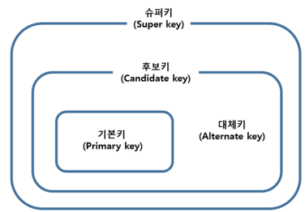

# Chapter 4. 데이터베이스

## Section1: 데이터베이스의 기본

- 데이터베이스: 일정한 규칙, 혹은 규약을 통해 구조화되어 저장되는 데이터의 모음
- DBMS(DataBase Management System): 데이터베이스를 제어, 관리하는 통합 시스템
- 데이터베이스 안에 데이터들은 특정 DBMS마다 정의된 쿼리 언어를 통해 삽입, 삭제, 수정, 조회 등을 수행할 수 있고 실시간 접근과 동시 공유가 가능
- Ex) 응용프로그램(Node.js, php) / DBMS(MySQL) / 데이터베이스

### 4.1.1 엔터티

- 여러개의 속성을 지닌 명사
- ex) (회원)[엔티티] <> (이름, 아이디, 주소, 전화번호)[속성]
- 속성은 서비스의 요구 사항에 맞춰 결정됨
- 강한 엔터디외 약한 엔터디로 구분 가능: 약한 엔터티는 다른 혼자서 존재하지 못하고 다른 엔터티 존재 여부에 종속 적임 (ex. 방(약한) 과 건물(강한))

### 4.1.2 릴레이션

- 엔터티가 릴레이션으로 변환되어 데이터베이스에 저장됨(기본 단위)
- 관계형 데이터베이스에서는 '테이블' , NoSQL 데이터베이스에서는 '컬렉션' 이라고 저장됨

<b>테이블과 컬렉션</b>

- 관계형 데이터베이스: MySQL, 레코드 - 테이블 - 데이터베이스
- NoSQL 데이터베이스: MongoDB, 도큐먼트 - 컬렉션 - 데이터베이스
- 레코드가 싸여서 테이블이 되고 테이블이 싸여서 데이터베이스가 됨

### 4.1.3 속성(Attribute)

- 릴레이션에서 관리하는 구체적이며 고유한 이름을 갖는 정보
- ex) 차라는 엔터디에서 차 번호, 바퀴 수, 차 색깔 등이 속성
- 릴레이션을 구성하는 각각의 열
- 데이터 필드라고도 함

### 4.1.4. 도메인

- 속성들이 가지고 있을 수 있는 값의 집합
- ex) 성별이라는 속성에서 도메인은 {남, 여} 가 됨

### 4.1.5 필드와 레코드

- 필드 : 속성과 유사 ex) name, ID, address, phonenumber
- 레코드: 튜플과 같음, 릴레이션의 행 단위 데이터

#### 필드 타입

- 필드는 타입을 가짐
- ex) 이름(문자열), 전화번호(숫자)

<b>숫자 타입</b>

TINYINT, SMALLINT, MEDIUMINT, INT, BIGINT

<b>날짜 타입</b>

DATE, DATETIME, TIMESTAMP

- DATE: 날짜 부분은 있지만 시간 부분은 없음, 지원 범위 1000-01-01 ~ 9999-12-31, 3byte
- DATETIME: 날짜 시간 모두 포함, 지원 범위 1000-01-01 00:00:00 ~ 9999-12-31 23:59:59, 8byte
- TIMESTAMP: 날짜 시간 모두 포함, 지원 범위 1970-01-01 00:00:01 ~ 2038-01-19 03:14:07, 4byte

<b>문자 타입</b>
CHAR, VARCHAR, TEXT, BLOB, ENUM, SET

- CHAR & VARCHAR:

  - CHAR: 0~255 사이, 레코드를 저장할 때 무조건 선언한 길이 값으로 '고정'해서 저장
  - VARCHAR: 0~65,535 사이, 입력된 데이터에 따라 용량을 가변시켜 저장함
  - CHAR는 유동적이지 않은 길이를 가진 데이터에 효율적, VARCHAR는 유동적인 길이를 가진 데이터 저장하는 것이 좋다

- TEXT & BLOB:

  - 둘 다 타입이 큰 데이터를 저장 할 때 사용
  - TEXT: 큰 문자열 저장에 쓰임, 주로 게시판의 본문 저장할 때 사용
  - BLOB: 이미지, 동영상 등 큰 데이터 저장에 씀, 보통 이미지는 아마존의 이미지 호스팅 S3를 이용하여 서버에 파일을 올리고 파일에 관한 경로를 VARCHAR 로 저장

- ENUM & SET:
  - 둘 다 문자열을 열거한 타입
  - EMUM: 단일 선택만 가능하고 ENUM 리스트에 없는 잘못된 값을 삽입하면 빈 문자열이 대신 삽입됨. 최대 65,535 개의 요소를 넣을 수 있음
  - SET: 여러 개의 데이터를 선택할 수 있고 비트 단위의 연산을 할 수 있다. 최대 64개 요소를 집어넣을 수 있다.
  - 둘 다 공간적으로 이점을 볼 수 있지만 애플리케이션 수정에 따라 데이터베이스의 ENUM 이나 SET에 정의한 목록을 수정해야 한다는 단점이 있음

### 4.1.6 관계

- 데이터베이스에는 여러 개의 테이블이 있고 이러한 테이블은 서로의 관계가 정의되어 있다. 이런 관계를 관계화살표(ERD, Entity-Relationship Diagram)로 나타냄

- '~B로 구성되어 있다'는 '~B 를 포함하고 있다' 와 같음

[관계화살표(ERD)]

#### 1:1 관계

- ex) 유저와 유저 이메일
- 1:1 관계 테이블을 두 개의 테이블로 나눠 테이블의 구조를 더 이해하기 쉽게 만들어 줌
- 그림 1번째

#### 1:N 관계

- ex) 유저와 상품
- 한 유저당 여러 개의 상품을 장바구니에 넣을 수 있음
- 한 개체가 다른 많은 개체를 포함하는 관계
- 0개를 넣을 수 도 있음(그림 4번째)

#### N:M 관계

- ex) 학생과 강의
- 학생도 강의를 많이 들을 수 있고 강의도 여러 명의 학생을 포함 할 수 있다
- N:M 은 테이블 두 개를 직접적으로 연결해서 구축하지 않고 1:N, 1:M 이라는 관계를 갖는 테이블 두 개로 나눠서 설정함

### 4.1.7 키 [부연 설명 링크](https://jerryjerryjerry.tistory.com/49)

테이블 간의 관계를 명확히 하고 테이블 자체의 인덱스를 위해 설정된 장치로 기본키, 외래키, 슈퍼키, 대체키가 있음

- 슈퍼키: <b>유일성</b>이 있고 그 안에 포함된 후보키는 <b>최소성</b>까지 갖춤
- 후보키 중 기본키로 선택 되지 못한 키는 대체키가 됨

> - 유일성: 중복되는 값이 없는 것
> - 최소성: 필드를 조합하지 않고 최소 필드만 써서 키를 형성하는 것

#### 기본키(Primary Key)

- PK 혹은 프라이머리키 라고 부름
- 유일성과 최소성을 만족
- 테이블에서 기본키는 오직 1개만 지정 가능
- NULL값을 가질 수 없고, 중복된 값을 가질 수 없다
- 테이블 안에서 유일하게 각 행들을 구별 할 수 있도록 쓰임

  - 자연키: 유저 테이블에 주민번호, 이름 , 성별 등 속성이 있을 때 이름, 성별을 중복이 될 수 있기 때문에 부적절. '자연스레' 주민번호가 남는데 이를
    자연키라고 함. 언젠가는 변하는 속성을 가짐
  - 인조키: 유저 테이블에 인위적으로 유저 아이디를 뷰여. 이를 통해 고유 식별자가 생김. Oracle은 sequence, MySQL은 auto increment등으로 설정, 변하는 속성이 없고 보통 기본키는 인조키로 설정

#### 외래키(Foreign Key)

- 다른 테이블의 기본키를 그대로 참조하는 값으로 개체와 관계를 식별하는 데 사용됨
- 외래키는 중복이 되어도 괜찮다

#### 후보키(candidate key)

- 기본키가 될 수 있는 후보들이면 최소성과 유일성 동시에 만족

#### 대체키(alternate key)

- 후보키가 2개 이상을 경우 어느 하나를 기본키로 지정하고 남은 후보키들

#### 슈퍼키(super key)

- 각 레코드를 유일하게 실별할 수 있는 유일성을 갖춘 키

## Section2: ERD와 정규화 과정

### 4.2.1 ERD의 중요성

- 시스템의 요구 사항을 기반으로 작성되고 이 ERD를 기반으로 데이터베이스를 구축함
- 디버킹 또는 비즈니스 프로세스 재설계가 필요할 경우 설계도 역할을 함
- 관계형 구조를 표현할 수 있는 데이터를 구성하는데 유용하지만 비정형 데이터를 충분히 표현할 수 없다

### 4.2.3 정규화 과정

- 저장 공간을 효율적으로 사용하기 위해 릴레이션을 여러 개로 분리하는 과정
- 정규형 원칙을 기반으로 정규형을 만들어가는 과정
- 정규화된 정도는 정규형(NF, Normal Form)으로 표현

<b>정규형 원칙</b>
자료의 중복성을 감소해야 하고, 독립적인 관계는 별개의 릴레이션으로 표현하며, 각각의 릴레이션은 독립적인 표현이 가능해야함

#### 제1정규형

- 한 개의 기본키에 대해 두 개 이상의 값을 가지는 반복 집합이 있어서는 안된다
- 반복 집합이 있다면 제거해야 함

[1정규화가 필요한 테이블]

**-> 과목이라는 속성에 도메인이 값이 두개이다 {운영체제, DB}**

[1NF]

#### 제2정규형

- 제 1정규형이며
- 부분 함수의 종속성을 제거한 상태(= 기본키가 아닌 모든 속성이 기본키에 완전 함수 종속적인 것 = 완전 함수 종속인 상태)

**성적의 특정 값을 알려면, 학생번호 + 과목 필요 (ex. 102번의 자바 성적 70)**
**지도교수를 알려면, 과목명만 필요 (ex.자바의 지도교수 박자바)**
**위 테이블에서 기본키는 (학생 번호, 과목)으로 복합키**
**지도교수 칼럼은(학생 번호,과목)에 종속되지 않고 (과목)에만 종속되는 '부분적 종속'이다**

제2 정규화를 만족하지 않으므로 아래와 같이 분해해야함

- 릴레이션을 분해할 때 동등한 릴레이션으로 분해해야되고, 정보 손실이 발생하지 않는 무손실 분해로 분해되어야 한다

#### 제3정규형

- 제2정규형이고
- 기본키를 제외한 속성들 간의 이행 종속성 (Transitive Dependency)이 없어야 한다

> 이행적 함수 종속
> A -> B 와 B-> C 가 존재하면 A -> C가 성립하는데, 이 때 C가 A에 이행적으로 함수 종속이 되었다고 함

**ID를 알면 등급을 알 수 있다**
**등급을 알면 할인율을 알 수 있다**
**따라서 ID를 알면 할인율을 알 수 있다**
**->이행 종속성이 존재하므로 제 3정규형을 만족하지 않는다**

ID와 등급, 등급과 할인율 릴레이션으로 분해해야 함

#### 보이스/코드 정규형(BCNF)

- 제 3정규화의 강화된 버전
- 모든 결정자가 후보키 집합에 속해야 한다(= 후보키 집합에 없는 칼럼이 결정자가 되어서는 안 된다)

> 결정자: 함수 종속 관계에서 특정 종속자를 결정 짓는 요소, X -> Y 일 때, X는 결정자 Y는 종속자

**(학생 번호, 과목)이 기본키로 지도교수를 알 수 있다**
**하지만 같은 과목을 다른 교수가 가르칠 수도 있어서 과목-> 지도교수 종속은 성립하지 않는다**
**하지만 지도교수가 어떤 과목을 가르치는지는 알 수 있으므로 지도교수-> 과목 종속이 성립한다**
**->이처럼 후보키 집합이 아닌 칼럼이 결정자가 되어버린 상황을 BCNF를 만족하지 않는다고 한다**

BCNF를 만족하기 위해서는 아래와 같이 분해하면 된다

#### 결론

- 정규화 과정을 거쳐 테이블을 나눈다고 성능이 100% 좋아지는 것을 아님
- 나눌수록 어떠한 쿼리는 조인을 해야하는 경우도 있어 느려질 수도 있기 때문에 정규화 혹은 비정규화 과정을 진행해야 한다

## Section3: 트랙잭션과 무결정

### 4.3.1 트랙잭션

- 트랜잭션은 데이터베이스에서 하나의 논리적 기능을 수행하기 위한 작업의 단위를 말함
- 여러 개의 쿼리들을 하나로 묶는 단위
- 원자성, 일관성, 독립성, 지속성 이 있음(ADIC특징)

#### 원자성

- all or nothing
- 트랜잭션과 관련된 일이 모두 수행되었거나 되지 않았거나를 보장하는 특징

> ex. 1000만원을 가진 홍철이가 0원을 가진 규영이에게 500만을 이체
>
> [operation 단위들]
>
> 1. 홍철의 잔고를 조화한다
> 2. 홍철에게서 500만 원을 뺀다
> 3. 규영이에게 500만 원을 넣는다
>
> 위 과정을 취소할 때, 홍철이는 다시 1000만원 규영이는 0원을 가져야한다. 홍철히는 500원 > 규영이는 0원이 되면 안된다는 것

- 트랜잭션 단위로 여러 로직들을 묶을 때 외부 API를 호출하는 것이 있으면 안된다
- 롤백이 일어났을 때 어떻게 해야 할 것인지에 대한 해결 방법이 있어야 함

##### 커밋과 롤백

- 커밋: 여러 쿼리가 성공적으로 처리되었다고 확정하는 명령어
- 롤백: 트랜잭션으로 처리한 하나의 묶음 과정을 일어나기 전으로 돌리는 일
- 커밋과 롤백 던에 데이터의 무결성을 보장하고, 데이터 변경 전에 변겅 상항을 쉽게 확인 할 수 있고 해당 작업을 그룹화할 수 있다

#### 일관성

- '허용된 방식'으로만 데이터를 변경해야 하는 것을 의미
- 데이터베이스에 기록된 모든 데이터는 여러 가지 조건, 규칙에 따라 유효함을 가져야함
- ex) 0원 밖에 없는 범석이는 제3자에게 500원을 입금할 수 없다

#### 격리성

- 트랜잭션 수행 시 서로 끼어들지 못하는 것
- 복수의 병렬 트랜잭션을 서로 격리되어 마치 순차적으로 실행되는 것처럼 작동되어야 하고, 데이터베이스는 여러 사용자가 같은 데이터에 접근할 수 있어야 함
- 순차적으로 실행하면 성능이 나빠지기 때문에 격리 수준이 나눠져서 격리성을 보장한다

#### 지속성

- 성공적으로 수행된 트랜잭션은 영원히 반영되어야 하는 것을 의미
- 데이터베이스에 시스템 장애가 발생해도 원래 상태로 복구하는 회복 기능(체크섬, 저널링, 롤백)이 있어야 함을 뜻함

> <b>체크섬</b>: 중복 검사를 한 형태로, 오류 정정을 통해 송신된 자료의 무결성을 보호하는 단순한 방법
> <b>저널링</b>: 파일 시스템 또는 데이터베이스 시스템에 변경 사항을 반영하기 전에 로깅하는 것, 트랜잭션 등 변경 사항에 대한 로그를 남기는 것

### 4.3.2 무결성

- 데이터의 정확성, 일관성, 유효성을 유지하는 것
- 무결성이 유지되어야 데이터베이스에 저장된 값고 현실 세계의 실제 값이 일치한다는 신뢰가 생감

#### 무결성의 종류

| 이름        | 설명                                                                                                   |
| ----------- | ------------------------------------------------------------------------------------------------------ |
| 개체 무결성 | 기본키로 선택된 필드는 빈 값을 허용하지 않습니다                                                       |
| 참조 무결성 | 서로 참조 관계에 있는 두 테이블의 데이터는 항상 일관된 값을 유지해야 한니다                            |
| 고유 무결성 | 특정 속성에 대해 고유한 값을 가지도록 조건이 주어진 경우 그 속성 값은 모두 고유한 값을 가집니다        |
| NULL 무결성 | 특정 속성 값에 NULL이 올 수 없다는 조건이 주어진 경우 그 속성 값은 NULL이 될 수 없다는 제약 조건입니다 |
