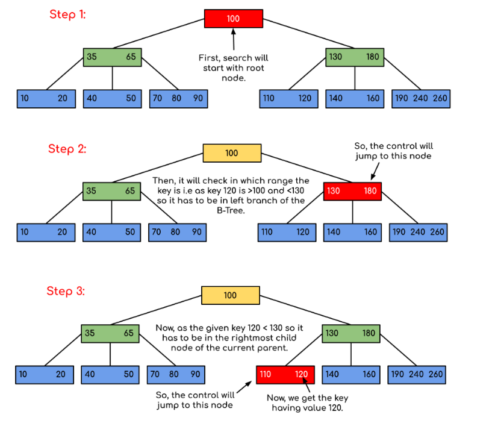
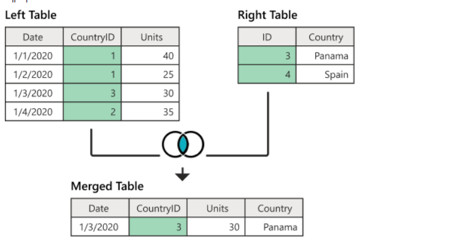

# Chapter 4. 데이터베이스

## Section 4: 데이터베이스의 종류

### 4.4.1 관계형 데이터베이스

- 관계형 데이터베이스는 행과 열을 가지는 표 형식 데이터를 저장하는 형태의 데이터베이스를 가리키며 SQL이라는 언어를 써서 조작
- ex) MySQL, PostgreSQL, 오라클, SQL Server, MSSQL이 있다
- 표준 SQL을 지키지만 각각 제품의 SQL을 사용(ex. 오라클 - PL/SQL , SQL Server - T-SQL, MySQL - SQL)

#### MySQL

- 대부분의 운영체제와 호환되며 가장 많이 사용되는 데이터베이스(ex. 메타, 트위터에서 사용)
- C,C++로 만들어졌으며 MyISAM 인덱스 압축 기술, B-트리 기반의 인덱스, 스레드 기반의 메모리 할당 시스템, 매우 빠른 조인, 최대 64개의 인덱스 제공
- 대용량 데이터베이스를 위해 설계되어 있고 롤백, 커밋, 이중 암호 지원 보안 등의 기능을 제공
- 스토리지 엔진은 데이터베이스의 심장 같은 역할을 하는데 모듈식 아키텍처로 쉽게 스토리지 엔진을 바꿀 수 있고 데이터 웨어하우징, 트랜잭션 처리, 고가용성 처리에 강점을 둠
- 스토리지 엔진 위에는 커넥터 API 및 서비스 계층을 통해 MySQL 데이터베이스와 쉽게 상호 작용 할 수 있다
- MySQL은 쿼리 개시를 지원해서 결과 집합을 저장한다. 사용자가 작성한 쿼리가 캐시에 있는 쿼리와 동일하면 서버는 단순히 구문 분석, 최적화 및 실행을 건너뛰고 캐시의 출력만 표시함

#### PostgreSQL

- 디스크 조각이 차지하는 영역을 회수할 수 있는 장치인 VACCUM이 특징이다
- 최대 테이블의 크기는 32TB이며 SQL뿐만 아니라 JSON을 이용해서 데이터에 접근할 수 있다
- 지정 시간에 복구하는 기능, 로깅, 접근 제어, 중첩된 트랜잭션, 백업 등을 할 수 있다

### 4.4.2 NoSQL 데이터베이스

#### MongoDB

- NoSQL(Not only SQL), SQL을 사용하지 않는 데이터베이스 ex)MongoDB, redis
- JSON을 통해 데이터에 접근할 수 있고, Binary JSON형태(BSON)로 데이터가 저장됨
- 키-값 데이터 모델에서 확장된 도큐먼트 기반의 데이터베이스
- 스키마를 정해 놓지 않고 데이터를 삽입할 수 있기 때문에 다양한 도메인의 데이터베이스를 기반으로 분석하거나 로깅 등을 구현할 때 강점을 보임
- 도큐먼트를 생성할 때마다 다른 컬렉션에서 중복된 값을 지니기 힘든 유니크한 값인 ObjectId가 생성됨(기본키로 유닉스 시간 기반의 타임스탬프, 랜덤 값, 카운터로 이루어짐)

#### Redis

- 인메모리 데이터베이스이자 키-값 데이터 모델 기반의 데이터베이스
- 기본적인 데이터 타입은 문자열이면 최대 512MB 까지 저장가능
- Set, Hash 지원
- pub/sub 기능을 통해 채팅 시스템, 다른 데이터베이스 앞단에 두어 사용하는 캐싱 계층, 단순한 키-값이 필요한 세션 정보 관리, 정렬된 셋(sorted set) 자료 구조를 이용한 실시간 순위표 서비스에 사용됨

## Section 5: 인덱스

### 4.5.1 인덱스의 필요성

- 인덱스는 데이터를 빠르게 찾을 수 있는 하나의 장치
- 인덱스를 설정하면 테이블 안에 내가 찾고자 하는 데이터를 빠르게 찾을 수 있다

### 4.5.2 B-트리

- 인덱스는 B-트리라는 자료 구조로 이루어져 있는데 이는 루트 노트, 리프 노드, 그리고 사이에 있는 브랜치 노드로 나뉜다
- 맨 위 루트 노드부터 탐색이 일어나며 브랜치 노드를 거쳐 리프 노트까지 내려옴


<b>목표: 120에 해당하는 데이터를 찾아야됨</b>
-> 루트 노드 100에서 부터 시작해서 120은 100보다 크고 130보다 작기 때문에 오른쪽 130이 있는 노드로 이동. 120은 130보다 작기 때문에 130의 리프 노드로 가서 110, 120을 보고 여기서 120을 가리키는 데이터 포인터를 이용해 결괏값을 반환한다.

> <b>인덱스가 효율적인 이유와 대수확장성</b>
>
> - 트리 깊이의 대수 확장성 떄문에 인덱스는 효율적이다
> - 대수 확장성: 트리 깊이가 리프 노드 수에 비해 매우 느리게 성장하는 것을 의미(인덱스가 한 깊이씩 증가할 때마다 인덱스 항목의 수는 4배씩 증가함)

### 4.5.3 인덱스를 만드는 방법

데이터베이스마다 다름

#### MySQL

- 클러스터형 인덱스와 세컨더리 인덱스가 있다

[클러스터 형]

- 클러스터형 인덱스는 테이블당 하나를 설정할 수 잇다.

  - primary key 옵션으로 기본키로 만들기
  - unique not null 옵션을 붙여 기본키로 만들지 않고 사용하기

[세컨더리 형]

- 세컨더리 인덱스는 보조 인덱스로 여러 개의 필드 값을 기반으로 쿼리를 많이 보낼 때 생성해야 되는 인덱스

  - create index... 명령어 사용

- ex) age라는 하나의 필드만으로 쿼리를 보낸다면 클러스터형 인덱스가 필요하니만 age, name, email 등 다양한 필드를 기반으로 쿼리를 보낼 때는 세컨더리 인덱스를 사용해야 성능이 좋다

#### MongoDB

- 도큐먼드틑 만들면 자동으로 ObjectID가 형성되며 해당 키가 기본키로 설정됨
- 세컨더리키도 부가적으로 설정해서 기본키와 세컨더리키를 같이 쓰는 복합 인덱스를 설정 할 수 있음

### 4.5.4 인덱스 최적화 기법

#### 1.인덱스는 비용이다

- 인덱스는 두 번 탐색하도록 강요함. 인덱스 리스트, 컬렉션 순으로 탐색하며 관련 읽기 비용이 든다
- 컬렉션이 수정되었을 때, 인덱스도 수정됨(B-트리의 높이를 균형 있게 조절하는 비용과 테이터를 효율적으로 조회 할 수 있도록 분산시키는 비용도 듦)
- 쿼리에 있는 필드에 인덱스를 무작정 다 설정하는 것도 아니다
- 컬렉션에서 가져와야 하는 양이 많을수록 인덱스를 사용하는 것은 비효율적이다

#### 2.항상 테스팅하라

- 서비스에서 사용하는 객체의 깊이, 테이블의 양 들이 다르기 때문에 인덱스 최적화 기법은 서비스마다 다르다
- 따라서 explain() 함수를 통해 테스팅을 하며 걸리는 시간을 최소화 해야 한다

#### 3. 복합 인덱스는 같음, 정렬, 다중 값, 카디널리티 순이다

- 여러 필드를 기반으로 조회를 할 때 복합 인덱스를 사용하는데 인덱스를 생성할 때는 순서가 있고 생성 순서에 따라 인덱스 성능이 달라짐
- 같음 > 정렬 > 다중 값( <> 등 많은 값을 출력해야 하는 쿼리에 쓰이는 필드) > 카디널리티(유니크한 값의 정도) 순으로 생성

## Section 6: 조인의 종류

- 하나의 테이블이 아닌 두 개 이상의 테이블을 묶어서 하나의 결과물을 만드는 것
- MySQL에서는 JOIN, MongoDB에서는 lookup이라는 쿼리를 이를 처리
- MongoDB lookup은 관계형 데이터베이스보다 성능이 떨어지므로 테이블을 조인하는 작업이 많을 수록 관계형 데이터베이스를 써야함
- 조인에는 내부 조인, 왼쪽 조인, 오른쪽 조인, 합집합 조인이 있다

#### 내부 조인(inner join)

- 두 테이블 간에 교집합
- 기준 테이블과 조인 테이블 모두에 조인 컬럼 데이터가 존재해야 조회됨

  

```
SELECT Sales.*, Countries.Conntry
FROM Sales
JOIN Countries
ON Sales.CountryID = Countries.ID
```

#### 왼쪽 조인(left outer join)

- 왼쪽 테이블을 기준으로 일치하는 행만 결합되고, 일치하지 않는 부분은 null 값으로 채워짐


```
SELECT *
FROM instructor
LEFT OUTER JOIN teaches
ON instructor.id = teaches.id
```

#### 오른쪽 조인(right outer join)

- 오른쪽 테이블을 기준으로 일치하는 행만 결합되고, 일치하지 않는 부분은 null 값으로 채워짐
  

```
SELECT *
FROM intructor
RIGHT OUTER JOIN teaches
ON instructor.id = teaches.id
```

#### 합집합 조인(full outer join)

- 공통된 부분만 골라 결합하는 Inner Join 과 다르게 공통되지 않은 행도 유지한다
- MySQL에서는 FULL OUTER JOIN을 지원하지 않으므로 LEFT OUTER JOIN 결과와 RIGHT OUTER JOIN결과를 UNION 하여 사용해야 함
  

```
SELECT *
FROM intructor
FULL OUTER JOIN teaches
ON instructor.id = teaches.id
```

## Section 7: 조인의 원리

### 4.7.1 중첩 루프 조인(Nested Loop Join)

- 중첩 for 문과 같은 원리로 조건에 맞는 조인을 하는 방법
- 랜덤 접근에 대한 비용이 많이 증가하므로 대용량의 테이블에서는 사용하지 않는다
- 중첩 루프 조인에서 조인할 테이블을 작은 블록으로 나눠서 블록으로 하나씩 조인하는 <b>블록 중첩 루프 조인</b> 방식도 있음

### 4.7.2 정렬 병합 조인

- 각각의 테이블을 조인할 필드 기준으로 정렬하고 정렬이 끝난 이후에 조인 작업을 수행하는 조인
- 조인할 때 쓸 적절한 인덱스가 없고 대용량의 테이블들을 조인하고 조인 조건으로 <,> 등 범위 비교 연산자가 있을 때 사용

### 4.7.3 해시 조인

- 해시 테이블을 기반으로 조인하는 방법
- 두 개의 테이블을 조인한다고 했을 떄 하나의 테이블이 메모리에 온전히 들어간다면 보통 중첩 루프 조인보다 더 효율저기다
- 동등(=) 조인에서만 사용가능
- MySQL의 해시 조인 단계는 빌드 단계, 프로브 단계로 나뉨

#### 빌드 단계

- 입력 테이블 중 하나를 기반으로 메모리 내 해시 테이블을 빌드하는 단계
- ex) persons와 countries라는 테이블을 조인한다고 했을 떄 둘 중 에 바이트가 작은 테이블을 기반으로 해서 테이블을 빌드함
- 조인에 사용되는 필드가 해시 테이블의 기로 사용됨

#### 프로브 단계

- 프로브 단계 동안 레코드 읽기를 시작
- 각 테이블은 한 번씩만 읽게 되어 중첩해서 두 개의 테이블을 읽는 중첩 루프 조인보다는 성능이 좋다
- 사용 가능한 메모리양을 시스템 변수 join_buffer_size에 의해 제어되며, 런타임 시에 조정할 수 있다
