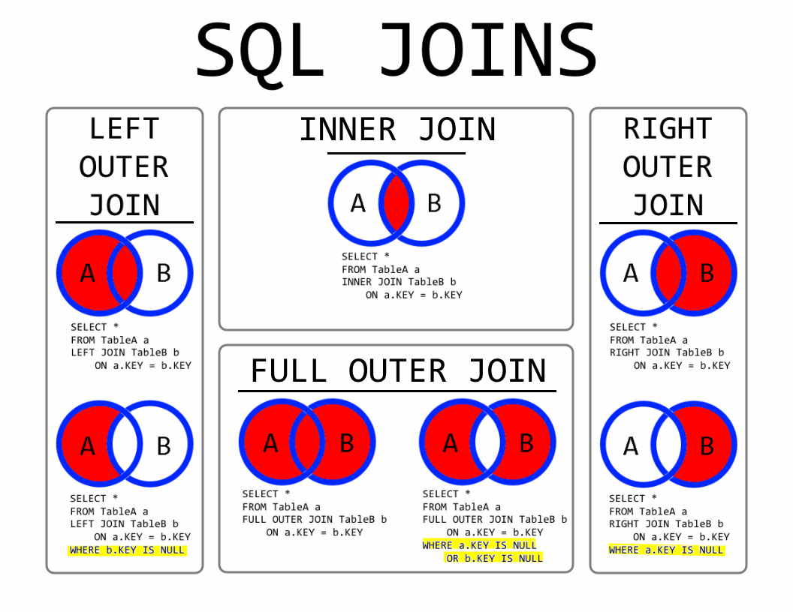

# CHAPTER 4. 데이터베이스

## SECTION 4. 데이터베이스의 종류

### 4.1 관계형 데이터베이스

- 행과 열을 가지는 표 형식 데이터를 저장하는 형테의 데이터베이스
- SQL이라는 언어를 써서 조작
- MySQL, PostgreSQL, 오라클, SQL Server, MSSQL 등이 있음

#### MySQL

: 대부분의 운영체제와 호환되며 현재 가장 많이 사용하는 데이터베이스

#### PostgreSQL

: 디스크 조각이 차지하는 영역을 회수학 수 있는 장치인 VACUUM이 특징

### 4.2 NoSQL 데이터베이스

- SQL을 사용하지 않는 데이터베이스. MongoDB와 redis 등이 있음

#### MongoDB

- JSON을 통해 데이터 접근 가능
- 키-값 데이터 모델에서 확장된 도큐먼트 기반의 데이터베이스

#### redis

- 인메모리 데이터베이스이자 키-값 데이터 모델 기반의 데이터베이스
- pub/sub 기능을 통해 채팅 시스템, 캐싱 계층 등에 사용

## SECTION 5. 인덱스

### 5.1 인덱스의 필요성

- 인덱스는 데이터를 빠르게 찾을 수 있는 장치

### 5.2 B-트리

- 인덱스는 보통 B-트리라는 자료 구조로 이루어져 있음. 이는 루트 노드, 리프 노드. 브랜치 노드로 나뉨

#### 인덱스가 효율적인 이유와 대수확장성

- 인덱스가 효율적인 이유 : 효율적인 단계를 거쳐 모든 요소에 접근할 수 있는 균형 잡힌 트리 구조와 트리 깊이의 대수확장성 때문
- 대수확장성 : 트리 깊이가 노드 수에 비해 매우 느리게 성장하는 것을 의미

### 5.3 인덱스 만드는 방법

- 인덱스를 만드는 방법은 데이터베이스마다 다르다

#### MySQL

- 클러스터형 인덱스와 세컨더리 인덱스
- 클러스터형 인덱스
  - 테이블당 하나 설정 가능
  - primary key 옵션으로 기본키로 만들면 생성할 수 있음
  - 기본키로 만들지 않고 unique not null 옵션을 붙이면 만들 수 있음
- 세컨더리 인덱스
  - 보조 인덱스로 여러 개의 필드 값을 기반으로 쿼리를 많이 보낼 때 생성해야 하는 인덱스
  - create index... 명령어를 기반으로 만들 수 있음
  - 하나의 인덱스만 생성할 것이라면 클러스터형 인덱스를 만드는 것이 더 성능이 좋다

#### MongoDB

- 도큐먼트를 만들면 자동으로 ObjectID가 형성되며 해당 키가 기본키로 설정
- 세컨더리키도 부가적으로 설정해서 기본키와 세컨더리키를 같이 쓰는 복합 인덱스를 설정할 수 있음

### 5.4 인덱스 최적화 기법

- 인덱스는 `비용`이다
  - 인덱스는 두 번 탐색하도록 강요한다. 인덱스 리스트, 그 다음 컬렉션 순으로 탐색하기 때문이며 관련 읽기 비용이 들게 된다.
  - 또한 컬렉션이 수정되었을 때 인덱스도 수정되어야 한다.
  - 그렇기 때문에 쿼리에 있는 필드에 인덱스를 무작정 다 설정하는 것이 답은 아니다.
  - 컬렉션에서 가져와야 하는 양이 많을수록 인덱스를 사용하는 것을 비효율적이다
- 항상 테스팅하라
  - 인덱스 최적화 기법은 서비스 특징에 따라 달라진다. 그렇기 때문에 항상 테스팅 하는 것이 중요
- 복합 인덱스는 같음, 정렬, 다중 값, 카디널리티 순이다

  - 보통 여러 필드를 기반으로 조회를 할 때 복합 인덱스를 생성하는데 이 인덱스를 생성할 때는 순서가 있고 생성 순서에 따라 인덱스 성능이 달라진다.

  1.  어떠한 값과 같음을 비교하는 == 이나 equal이라는 쿼리가 있다면 제일 먼저 인덱스로 설정한다
  2.  정렬에 쓰는 필드라면 그 다음 인덱스로 설정한다
  3.  다중 값을 출력해야 하는 필드, 즉 쿼리 자체가 > 이거나 < 등 많은 값을 출력해야 하는 쿼리에 쓰는 필드라면 나중에 인덱스를 설정한다
  4.  유니크한 값의 정도를 카디널리티라고 한다. 이 카디널리티가 높은 순서를 기반으로 인덱스를 생성해야 한다

## SECTION 6. 조인의 종류

- 조인 : 하나의 테이블이 아닌 두 개 이상의 테이블을 묶어서 하나의 결과물을 만드는 것
- MongoDB에서는 lookup이라는 쿼리로 조인을 처리할 수 있지만 관계형 DB보다 성능이 떨어진다.
- 여러 테이블을 조인하는 작업이 많으면 MongoDB보다는 관계형 데이터베이스를 써야한다.

> 

> 출처: https://imgur.com/gallery/8u7fc

### 6.1 내부 조인 (Inner Join)

- 왼쪽 테이블과 오른쪽 테이블의 두 행이 모두 일치하는 행이 있는 부분만 표기
- 두 테이블 간에 교집합

```
SELECT * FROM TableA A
INNER JOIN TableB B ON
A.key = B.key
```

### 6.2 왼쪽 조인 (Left Outer Join)

-왼쪽 테이블의 모든 행이 결과 테이블에 표기

- 테이블 B의 일치하는 부분의 레코드와 함께 테이블 A를 기준으로 완전한 레코드 집합 생성
- 만약 테이블 B에 일치하는 항목이 없으면 해당 값은 null

```
SELECT * FROM TableA A
LEFT JOIN TableB B ON
A.key = B.key
```

### 6.3 오른쪽 조인 (Right Outer Join)

- 오른쪽 테이블의 모든 행이 결과 테이블에 표기
- 오른쪽 조인은 테이블 A에서 일치하는 부분의 레코드와 함께 테이블 B를 기준으로 완전한 레코드 집합 생성
- 만약 테이블 A에 일치하는 항목이 없으면 해당 값은 null

```
SELECT * FROM TableA A
RIGHT JOIN TableB B ON
A.key = B.key
```

### 6.4 합집합 조인 (Full Outer Join)

- 두 개의 테이블을 기반으로 조인 조건에 만족하지 않는 행까지 모두 표기
- 합집합 조인(완전 외부 조인)은 양쪽 테이블에서 일치하는 레코드와 함께 테이블 A와 테이블 B의 모든 레코드 집합을 생성
- 일치하는 항목이 없으면 누락된 쪽에 null값 포함

```
SELECT * FROM TableA A
FULL OUTER JOIN TableB B ON
A.key = B.key
```

## SECTION 7. 조인의 원리

- 조인은 조인의 원리를 기반으로 조인 작업이 이루어짐

### 7.1 중첩 루프 조인

- 중첩 루프 조인 : 중첩 for 문과 같은 원리로 조건에 맞는 조인을 하는 방법
- 랜덤 접근에 대한 비용이 많이 증가하므로 대용량의 테이블에서는 사용하지 않음
- EX) 't1, t2 테이블을 조인한다'라고 했을 때 첫 번째 테이블에서 행을 한 번에 하나씩 읽고 그 다음 테이블에서도 행을 하나씩 읽어 조건에 맞는 레코드를 찾아 결괏값 반환

```
for each row in t1 matching reference key {
	for each row in t2 matching reference key {
		if row satisfies join conditions, send to client}
}
```

> **블록 중첩 루프 조인**

> : 중첩 루프 조인에서 발전한 조인할 테이블을 작은 블록으로 나눠서 블록 하나씩 조인

### 7.2 정렬 병합 조인

- 각각의 테이블을 조인할 필드 기준으로 정렬하고 정렬이 끝난 이후에 조인 작업을 수행
- 조인할 때 쓸 적절한 인덱스가 없고 대용량의 테이블들을 조인하고 조인조건으로 범위 비교 연산자가 있을 때 사용

### 7.3 해시 조인

- 해시 테이블을 기반으로 조인
- 두 개의 테이블을 조인할 때 하나의 테이블이 메모리에 온전히 들어가면 중첩 루프 조인보다도 효율적
- 동등 조인에서만 사용할 수 있음
- MySQL의 해시 조인 단계는 빌드 단계, 프로브 단계로 나뉨
  - 빌드 단계
    - 입력 테이블 중 하나를 기반으로 메모리 내 해시 테이블을 빌드
    - persons와 countries라는 테이블을 조인한다고 했을 때 둘 중 바이트가 더 작은 테이블을 기반으로 해서 테이블 빌드
    - 조인에 사용되는 필드가 해시 테이블의 키로 사용됨
  - 프로브 단계
    - 프로브 단계 동안 레코드 읽기를 시작
    - 각 레코드에서 persons.country_id에 일치하는 레코드를 찾아서 결괏값으로 변환
    - 이를 통해 각 테이블은 한 번씩만 읽게 되어 중첩해서 두 개의 테이블을 읽는 중첩 루프 조인보다 보통은 성능이 더 좋음
    - 사용 가능한 메모리양은 시스템 변수 join_buffer_size에 의해 제어. 런타임시 조정 가능
