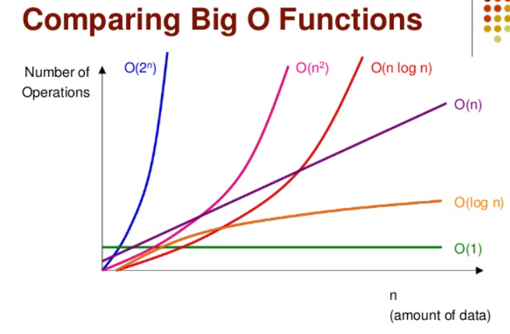
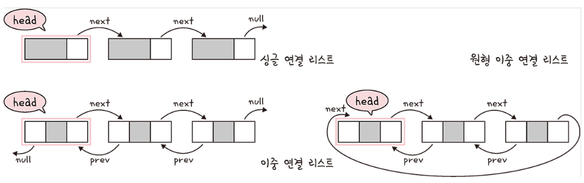
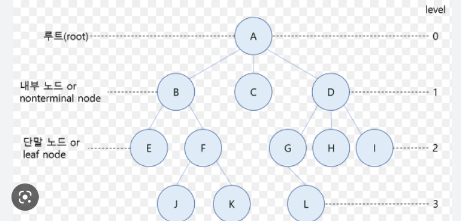
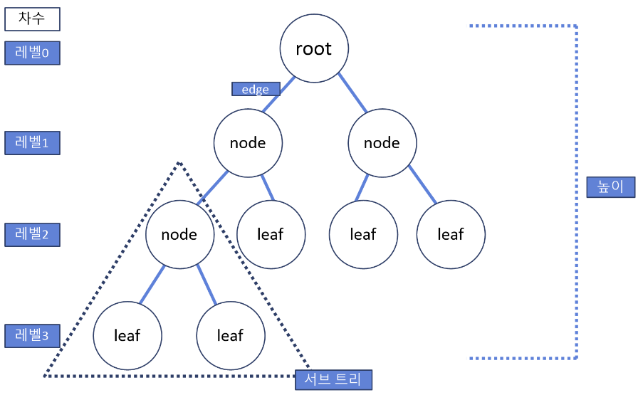
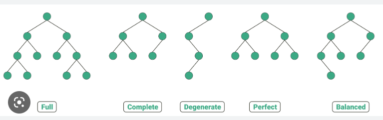
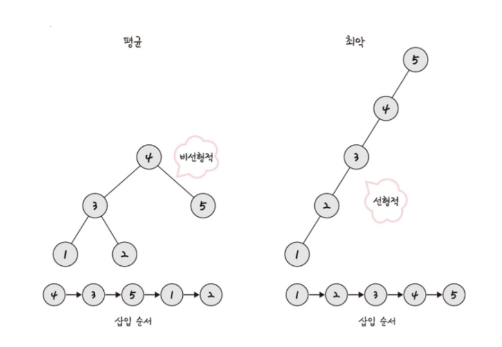
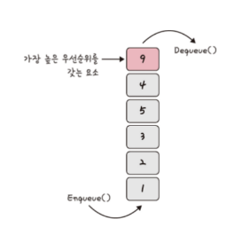

# Chapter 5. 자료 구조

## Section 1: 복잡도

자료 구조: 효율적으로 데이터를 관리하고 수정, 삭제, 탐색, 저장할 수 있는 데이터 집합
복잡도는 <b>시간 복잡도</b>와 <b>공간 복잡도</b>로 나뉨

### 5.1.1 시간 복잡도

#### 빅오 표기법

- 시간 복잡도: 문제를 해결하는 데 걸리는 시간과 입력의 함수 관계
- 어떠한 알고리즘이의 로직이 '얼마나 오랜 시간'이 걸리는지를 나타내는데 쓰임
- 빅오 표기법: 입력 범위 n을 기준으로 로직이 몇번 반복되는지 나타내는 것
- ex) 입력 크기 n의 모든 입력에 대한 알고리즘에 필요한 시간이 10n^2 +n 이라면 빅오 표기법으로 시간 복잡도는 O(n^2) 가 된다
- <b>가장 영향을 많이 끼치는</b> 항의 상수 인자를 빠고 나머지 항을 없앤 것
- 입력 크기가 커질수록 연산량이 가장 많아지는 것을 n의 제곱항이고 다른 것은 그에 비해 미미하기 이것만 신경 쓰면 된다는 이론이다

#### 시간복잡도의 존재 이유와 속도 비교

- 시간복잡도는 효율적인 코드로 개선하는데 쓰이는 척도가 된다
- 입력 크기가 커질수록 O(1)과 O(n)은 시간의 차이가 엄청나다
- O(1) > O(n) > O(n^2) 순서대로 지향해야 한다

### 5.1.2 공간 복잡도

- 프로그램을 실행시켰을 때 필요로 하는 자원 공간의 양
- 정적 변수로 선언된 것 말고도 동적으로 재귀적인 함수로 인해 공간을 계속해서 필요로 하는 경우로 포함

### 5.1.3 자료 구조에서의 시간 복잡도

- 자료구조를 쓸 떄는 시간 복잡도를 잘 생각해야 하는데 이따 평균, 최악의 시간 복잡도를 고려하면 된다

[자료 구조의 <b>평균 시간</b> 복잡도]
|자료 구조| 접근 | 탐색 | 삽입 | 삭제 |
| ---- | --- | --- | --- | ---- |
| 배열 | O(1) | O(n) | O(n) | O(n)|
| 스택 | O(n)|O(n)| O(1) |O(1)|
| 큐 | O(n) | O(n) | O(1) | O(1) |
| 이중 연결 리스트 | O(n) | O(n) | O(1) | O(1) |
| 해시 테이블 | O(1) | O(1) | O(1) | O(1) |
| 이진 탐색 트리 | O(logn) | O(logn) | O(logn) | O(logn) |
| AVL 트리 | O(logn) | O(logn) | O(logn) | O(logn) |
| 레드 블랙 트리 | O(logn) | O(logn) | O(logn) | O(logn) |

[자료 구조의 <b>최악의 시간</b> 복잡도]
|자료 구조| 접근 | 탐색 | 삽입 | 삭제 |
| ---- | --- | --- | --- | ---- |
| 배열 | O(1) | O(n) | O(n) | O(n)|
| 스택 | O(n)|O(n)| O(1) |O(1)|
| 큐 | O(n) | O(n) | O(1) | O(1) |
| 이중 연결 리스트 | O(n) | O(n) | O(1) | O(1) |
| 해시 테이블 | O(n) | O(n) | O(n) | O(n) |
| 이진 탐색 트리 | O(n) | O(n) | O(n) | O(n) |
| AVL 트리 | O(logn) | O(logn) | O(logn) | O(logn) |
| 레드 블랙 트리 | O(logn) | O(logn) | O(logn) | O(logn) |

## Section 2: 선형 자료 구조

선형 자료 구조: 요소가 일렬로 나열되어 있는 자료 구조

### 5.2.1 연결 리스트

💡 데이터를 감싼 노드를 포인터로 연결해서 공간적인 효율성을 극대화시킨 자료구조

- 삽입과 삭제는 O(1), 탐색은 O(n)이 걸린다
- prev 포인터와 next 포인터로 앞과 뒤의 노드를 연결시킨 것
- 맨 앞에 있는 노드를 헤드라고 함

> <b>싱글 연결 리스트</b>: next 포인터만 가짐
> <b>이중 연결 리스트</b>: next 포인터와 prev 포인터를 가짐
> <b>원형 이중 연결 리스트</b>: 이중 연결리스트에서 마지막 노드의 next 포인터가 헤드 노드를 가리키는 것

### 5.2.2 배열

💡 같은 타입의 변수들로 이루어져 있고, 크기가 정해져 있으며, 인접한 메모리 위치에 있는 데이터를 모아좋은 집합

- 중복을 허용하고 순서가 존재한다
- 삽입 삭제는 O(n)이 걸리고 탐색을 O(1)이 되어 랜덤 접근이 가능하다
- 데이터 추가와 삭제가 많이 하는 것은 연결 리스트, 탐색을 많이 하는 것은 배열로 하는 것이 좋다

> 랜덤 접근: 배열과 같이 순차적인 데이터가 있을 때 임의의 인덱스에 해당하는 데이터에 접근하는 기능
> 순차적 접근: 데이터를 저장된 순서대로 검색해야 하는 순차적 접근

#### 배열과 연결 리스트 비교

💡 탐색은 배열이 빠르고, 데이터 추가 및 삭제는 연결 리스트가 더 빠르다

<b>배열</b>

- 상자를 순서대로 나열한 구조이며 몇 번째 상자인지만 알면 해당 상자의 요소를 끄집어낼 수 있다
- 랜덤 접근이 가능하다, O(1)

<b>연결 리스트</b>

- 상자를 선으로 연결한 데이티 구조로 상자 안의 요소를 알기 위해서는 하나씩 상자 내부를 확인해봐야 한다
- 랜덤 접근이 불가능하다, O(n)

### 5.2.3 벡터

💡동적으로 요소를 할당할 수 있는 동적 배열

- 컴파일 시점에 개수를 모른다면 백터를 써야 함
- 중복을 허용하고 순서가 있고 랜덤 접근이 가능
- 탐색과 맨 뒤의 요소를 삭제하거나 삽입하는 데 O(1)이 걸림, 맨 뒤나 맨 앞이 아닌 요소를 삭제, 삽입하는데 O(n)이 걸림

- 뒤에서 삽입하는 push_back()은 O(1)이 걸림
  - push back을 한다고 해서 매번 크기가 증가하는 것이 아니라 2의 제곱승 + 1 마다 백터 크기를 2배로 늘림

> push_back(): 뒤부터 삽입
> pop_back(): 맨 뒤부터 지움
> erase(): 지움
> find(): 요소 찾기
> clear(): 배열 초기화

### 5.2.4 스택

💡마지막으로 들어간 데이터가 가장 첫 번째로 나오는 성질(First In Last Out)

- 재귀적인 함수, 알고리즘에 사용되며 웹 브라우저 방문 기록에 쓰임
- 삽입과 삭제에 O(1), 탐색에 O(n)이 걸림

### 5.2.5 큐

💡먼저 집어넣은 데이터가 먼저 나오는 성질(First In First Out)

- CPU 작업을 기다리는 프로세스, 스레드 행렬 또는 네트워크 접속을 기다리는 행렬, 너비 우서 탐색, 캐시 등에 사용됨
- 삽입과 삭제에 O(1), 탐색에 O(n)이 걸림

## Section 3: 비선형 자료 구조

일렬로 나열하지 않고 자료 순서나 관계가 복잡한 구조
일반적으로 트리나 그래프를 말함

### 5.3.1 그래프

💡 정점과 간선으로 이루어지 자료 구조

#### 정점과 간선

- 정점(vertex): 위치라는 개념. (node 라고도 부름)
- 간선(edge): 위치 간의 관계. 즉, 노드를 연결하는 선 (link, branch 라고도 부름)
- 정점과 간선으로 이루어진 집합을 그래프라고 함

#### 가중치

- 간선과 정점 사이에 드는 비용
- ex) 1번 노드와 2번 노드까지 가는 비용이 한 칸이면 가중치는 1칸이 된다

### 5.3.2 트리

💡 그래프 중 하나로 정점과 간선으로 이루어져 있고, 트리 구조로 배열된 일종의 <b>계층적 데이터</b>의 집합

<b>트리의 특징</b>

1.  부모, 자식 계층 구조를 가진다
2.  간선 수 = 노드 수 - 1
3.  임의의 두 노드 사이의 경로는 '유일무이'하게 '존재'함. 트리 내의 어떤 노드와 어떤 노드까지의 경로는 반드시 있다

> 루트 노드: 가장 위에 있는 노드
> 내부 노드: 루트 노드와 내부 노드 사이에 있는 노드
> 리프 노드: 지삭 노드가 없는 노드

<b>트리의 높이와 레벨</b>

1. 깊이: 루트 노드부터 특정 노드까지 최단 거리로 갔을 때 거리
2. 높이: 루트 노드 부터 리프 노드까지 거리 중 가장 긴 거리
3. 레벨: 깊이와 같은 의미
4. 서브 트리: 트리 내의 하위 집합, 부분 집합

#### 이진 트리

💡자식의 노드 수가 두 개 이하인 트리

<b>정이진 트리(full binary tree)</b>: 자식 노드가 0 또는 2개인 이진 트리
<b>완전 이진 트리(complete binary tree)</b>: 왼쪽에서부터 채워져 있는 이진 트리. 마지막 레벨을 제외하고 모든 레벨이 완전히 다 채워져 있음
<b>변질 이진 트리(degenerate binary tree)</b>: 자식 노드가 하나밖에 없는 이진 트리
<b>포화 이진 트리(perfect binary tree)</b>: 모든 노드가 꽉 차 있는 이진 트리
<b>균형 이진 트리(balanced binary tree)</b>: 왼쪽과 오른쪽 노드의 높이 차이가 1이하인 이진 트리. ex) map, set을 구성하는 레드 블랙 트리

#### 이진 탐색 트리

💡노드의 오른쪽 하위 트리는 '노드 값보다 큰 값', 왼쪽 하위 트리는 '노드 값보다 작은 값'이 들어 있는 트리'

- 탐색할 때 보통 O(logn)이 걸리는데, 최악의 경우 O(n)이 걸린다 -> 삽입 순서에 따라 <b>선형적</b>일 수도 있기 때문이다

#### AVL 트리

💡 최악의 경우 선형적인 트리가 되는 것을 방지하고 스스로 균형을 잡는 이진 탐색 트리

- 두 자식 서브트리의 높이는 항상 최대 1만틈 차이 난다
- 탐색, 삽입, 삭제 모두 시간 복잡도가 O(logn) 이다
- 삽입, 삭제를 할 때마다 균형이 안 맞는 것을 맞추기 위해 트리 일부를 왼쪽 혹은 오른쪽으로 회전시키며 균형을 잡는다

#### 레드 블랙 트리

💡각 노드는 빨간색 검은색의 색상을 나타내는 추가 비트를 저장하며 삽입 및 삭제 중에 트리가 균형을 유지하도록 하는 사용됨

- C++ STL의 set, multiset, map, and multimap이 레드 블랙 트리를 이용하여 구현됨
- 규칙을 기반으로 균형을 잡음 -> ex) 모든 리프 노드와 루트 노드는 블랙이고 어떤 노드가 레드이면 그 노드의 자깃을 반드시 블랙이다

### 5.3.3 힙

💡완전 이진 트리 기반의 자료 구조이며, 최소힙과 최대힙 두가지가 있고 해당 힙에 따라 특정한 특징을 지킨 트리

<b>최대힙</b>: 루트 노드에 있는 키는 모든 자식에 있는 키 중에서 가장 커야 함. 각 노드의 자식와의 관계도 이와 같은 특징이 재귀적으로 이루어져야 함
<b>최소힙</b>: 루트 노드에 있는 키는 모든 자식에 있는 키 중에서 가장 작아야 함

#### 최대힙의 삽입

- 새로운 요소가 들어오면 힙의 마지막 노드에 이어서 삽입
- 새로운 노드를 부모 노드들과 크기를 비교하며 교환해서 힙의 성질을 만족시킴
- 이 노드가 점차 올라가면서 해당 노드 위에 있는 노드와 스왑하는 과정을 거쳐 최대힙 조건을 만족

#### 최대힙의 삭제

- 최댓값은 루트 노드이므로 루트 노드가 삭제되고, 그 이후 마지막 노드와 루트 노드를 스왑하여 또 다시 스왑 등의 과정을 거쳐 재구성 됨

### 5.3.4 우선순위 큐

💡대기열에서 우선순위가 높은 요소가 우선순위가 낮은 요소보다 먼저 제공되는 자료 구조

- 힙을 기반으로 구현됨
- priority_queue<int, vector<int>, greater<int>> 로 표기
- greater를 써서 오름차순, less를 써서 내림차순으로 바꿀 수 있다

### 5.3.5 맵

💡 특정 순서에 따라 키와 매칭된 값의 조합으로 형성된 자료 구조

- ex) '이승철' :1 , '박동영' :2 같은 방식으로 string: int 형태로 값을 할당할 때 map 사용
- 레드 블랙 트리 자료 구조를 기반으로 형성되고, 삽입하며 자동으로 정렬됨
- map<string,int> 형태로 구현
- <b>헤시 테이블</b>을 구현할 때 쓰며 정렬을 보장하지 않는 unordered_map과 정렬을 보장하는 map 두 가지를 가짐
- clear(): 맵에 있는 모든 요소를 삭제
- size(): map 크기를 구함
- erase(): 해당 키와 키에 매핑된 값을 지울 수 있음

### 5.3.6 셋

💡특정 순서에 따라 고유한 요소를 저장하는 컨테이너이며, 중복X, 오로지 희소한 (unique) 값만 저장하는 자료 구조

### 5.3.7 해시 테이블

💡무한에 가까운 데이터들을 유한한 개수의 해시 값으로 매핑한 테이블

- 작은 크기의 캐시 메모리로도 프로세스를 관리할 수 있음
- 삽입, 삭제, 탐색 시 평균적으로 O(1)의 시간 복잡도를 가지며 unordered_map으로 구현함
