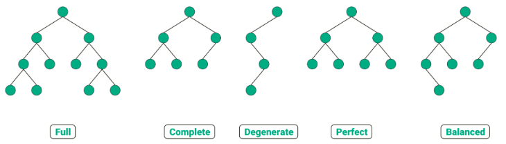

# CHAPTER 5. 자료구조

- 자료구조 : 효율적으로 데이터를 관리하고 수정, 삭제, 탐색, 저장할 수 있는 데이터 집합

## SECTION 1. 복잡도

### 1.1 시간 복잡도

#### 빅오 표기법

- 기본적으로 알고리즘 최악의 경우 복잡도를 측정
- 데이터의 양에 따라 얼마나 오랜 시간이 걸리는지 표기하는 것
- 입력 범위 n을 기준으로 로직이 몇번 반복되는지 나타내는 것
- 아래 그림에서 확인할 수 있듯이 빅오 표기법은 $O(1) < O(log n) < O(n) < O(nlogn) < O(n^2) < O(2^n)$ 이 순서대로 시간이 오래 걸린다.

> **시간 복잡도의 존재 이유**
>
> 효율적인 코드로 개선하는데 쓰이는 척도가 됨

### 1.2 공간 복잡도

- 공간복잡도 : 프로그램을 실행시켰을 때 필요로 하는 자원 공간의 양
- 정적 변수로 선언된 것 말고도 동적으로 재귀적인 함수로 인해 공간을 계속해서 필요로 할 경우도 포함
- 시간 복잡도보다 중요도는 떨어지지만, 만약 임베디드처럼 하드웨어 환경이 매우 한정적일 경우 공간복잡도가 상당히 중요하다

### 1.3 자료 구조에서의 시간 복잡도

- 자료 구조를 쓸 때는 시간 복잡도를 잘 생각해야 함

## SECTION 2. 선형 자료 구조

- 선형 자료 구조 : 요소가 일렬로 나열되어 있는 자료 구조

### 2.1 연결 리스트

- 연결 리스트 : 데이터를 감싼 노드를 포인터로 연결해서 공간적인 효율성을 극대화시킨 자료 구조
- 삽입과 삭제가 O(1) 걸리며 탐색에는 O(n)이 걸림
- prev 포인터와 next 포인터로 앞과 뒤의 노드를 연결시킨 것이 연결리스트
- 연결리스트는 싱글 연결 리스트, 이중 연결 리스트, 원형 이중 연결 리스트가 있음
- 맨 앞에 있는 노드를 헤드라고 함
- 싱글 연결 리스트: next 포인터만 가짐
- 이중 연결 리스트: next 포인터와 prev 포인터를 가짐
- 원형 이중 연결 리스트: 이중 연결 리스트와 같지만 마지막 노드의 next 포인터가 헤드 노드를 가리키는 것

### 2.2 배열

- 같은 타입의 변수들로 이루어져 있고 크기가 정해져 있으며 인접한 메모리 위치에 있는 데이터를 모아놓은 집합
- 중복을 허용, 순서가 있음
- 탐색에 O(1)이 되어 랜덤 접근 가능, 삽입과 삭제에는 O(n)이 걸림
- 데이터 추가와 삭제를 많이 하는 것은 연결 리스트, 탐색을 많이 하는 것을 배열로 하는 것이 좋음
- 배열은 인덱스에 해당하는 원소를 빠르게 접근해야 하거나 간단하게 데이터를 쌓고 싶을 때 사용
- 랜덤 접근과 순차적 접근
  - 랜덤 접근 : 동일한 시간에 배열과 같은 순차적인 데이터가 있을 때 임의의 인덱스에 해당하는 데이터에 접근할 수 있는 기능
  - 순차적 접근 : 데이터를 저장된 순서대로 검색해야 함

> **배열과 연결리스트**
> 데이터 원소들을 순서를 지어 늘어놓는다는 점에서 연결 리스트 (linked list) 는 선형 배열 (linear array) 과 비슷한 면이 있지만, 데이터 원소들을 늘어놓는 방식에서 이 두 가지는 큰 차이가 있습니다. 구체적으로는, 선형 배열이 번호가 붙여진 칸에 원소들을 채워넣는 방식이라고 한다면, 연결 리스트는 각 원소들을 줄줄이 엮어서 관리하는 방식입니다. 그렇다면, 선형 배열에 비해서 연결 리스트가 가지는 이점은 무엇일까요?
>
> 연결 리스트에서는 원소들이 링크 (link) 라고 부르는 고리로 연결되어 있으므로, 가운데에서 끊어 하나를 삭제하거나, 아니면 가운데를 끊고 그 자리에 다른 원소를 (원소들을) 삽입하는 것이 선형 배열의 경우보다 쉽습니다. 여기에서 쉽다 라고 표현한 것은, 빠른 시간 내에 처리할 수 있다는 뜻입니다. 이러한 이점 때문에, 원소의 삽입/삭제가 빈번히 일어나는 응용에서는 연결 리스트가 많이 이용됩니다. 컴퓨터 시스템을 구성하는 중요한 요소인 운영체제 (operating system) 의 내부에서도 이러한 연결 리스트가 여러 곳에서 이용되고 있습니다.
>
> 그렇다면, 연결 리스트가 선형 배열에 비해서 가지는 단점은 없을까요? 물론 있습니다. 세상에 공짜는 없는 법이어서, 위에서 말한 바와 같이 원소의 삽입과 삭제가 용이하다는 장점은 거저 얻어지지 않습니다. 생각하기 쉬운 하나의 단점은, 선형 배열에 비해서 데이터 구조 표현에 소요되는 저장 공간 (메모리) 소요가 크다는 점입니다. 링크 또한 메모리에 저장되어 있어야 하므로, 연결 리스트를 표현하기 위해서는 동일한 데이터 원소들을 담기 위하여 사용하는 메모리 요구량이 더 큽니다. 그보다 더 우리의 관심을 끄는 단점은, k 번째의 원소 를 찾아가는 데에는 선형 배열의 경우보다 시간이 오래 걸린다는 점입니다. 선형 배열에서는 데이터 원소들이 번호가 붙여진 칸들에 들어 있으므로 그 번호를 이용하여 대번에 특정 번째의 원소를 찾아갈 수 있는 데 비하여, 연결 리스트에서는 단지 원소들이 고리로 연결된 모습을 하고 있으므로 특정 번째의 원소를 접근하려면 앞에서부터 하나씩 링크를 따라가면서 찾아가야 합니다.

### 2.3 벡터

- 동적으로 요소를 할당할 수 있는 동적 배열
- 컴파일 시점에 개수를 모른다면 벡터를 써야함
- 중복 허용, 순서 있음, 랜덤 접근 가능
- 탐색과 맨 뒤의 요소를 삭제하거나 삽입하는데 O(1) 걸림,
- 맨 뒤나 맨 앞이 아닌 요소를 삭제하고 삽입하는 데 O(n)의 시간이 걸림

> **벡터와 배열**
> 벡터는 배열과 비슷하지만 몇 가지 이점이 있다.
>
> 1. 가변 배열이기 때문에 메모리를 효율적으로 사용할 수 있다.
> 2. 중간 데이터를 순차적 접근을 통해 얻지 않아도 된다.
>
> 출처 : https://bbmsk2.tistory.com/124

### 2.4 스택

- 가장 마지막으로 들어간 데이터가 가장 첫번째로 나오는 성질을 가진 자료구조(Last In First Out)
- 재귀적인 함수, 알고리즘, 웹 브라우저 방문 기록 등에 쓰임
  - 웹 브라우저 방문기록 (뒤로가기)
  - 실행 취소
  - 역순 문자열 만들기
  - 후위 표기법 계산
    - 후위 표기법 : 연산자를 연산 대상의 뒤에 쓰는 연산 표기법
    - EX) `1 + 2`를 `1 2 +` 로 쓰는 것
  - 재귀 알고리즘을 만들 때
- 삽입 및 삭제에 O(1), 탐색에 O(n) 걸림

### 2.5 큐

- 먼저 집어넣은 데이터가 먼저 나오는 성질(First In First Out)을 지닌 자료구조
- 삽입 및 삭제에 O(1), 탐색에 O(n)이 걸림
- CPU 작업을 기다리는 프로세스, 스레드 행렬, 네트워크 접속을 기다리는 행렬, 너비 우선 탐색, 캐시 등에 사용
  - 은행 업무
  - 대기열 순서와 같은 우선순위의 작업 예약 등
  - 서비스 센터의 대기시간
  - 프로세스 관리

## SECTION 3. 비선형 자료구조

- 비선형 자료구조 : 일렬로 나열하지 않고 자료 순서나 관계가 복잡한 구조
- EX) 트리, 그래프

### 3.1 그래프

- 그래프 : 정점과 간선으로 이루어진 자료 구조
  - 어떠한 곳에서 어떠한 곳으로 무언가를 통해 간다고 했을 때 '어떠한 곳'은 정점(vertex), '무언가'는 간선(edge)
  - 정점으로 나가는 간선은 해당 정점의 outdegree, 들어오는 간선은 해당 정점의 indegree
  - 정점은 약자로 V 또는 U라고 함
  - 정점과 간선으로 이루어진 집합을 그래프라고 함
- 가중치
  - 가중치는 간선과 정점 사이에 드는 비용
  - 1번 노드와 2번 노드까지 가는 비용이 한칸이라면 1번 노드에서 2번 노드까지의 가중치는 한칸

### 3.2 트리

- 트리 :그래프 중 하나. 정점과 간선으로 이루어져 있고 트리 구조로 배열된 일종의 계층적 데이터의 집합
- 루트 노드, 내부 노드, 리프 노드 등으로 구성
- 트리로 이루어진 집합을 숲이라고 함
- 트리의 특징
  - 부모, 자식 계층 구조를 가짐. 같은 경로상에서 어떤 노드보다 위에 있으면 부모, 아래에 있으면 자식 노드
  - V - 1 = E 간선 수는 노드 수-1
  - 임의의 두 노드 사이의 경로는 유일무이하게 존재. 트리 내의 어떤 노드와 어떤 노드까지의 경로는 반드시 있음
- 트리는 루트 노드, 내부 노드, 리프 노드로 이루어져 있음
  - 루트 노드: 가장 위에 있는 노드
  - 내부 노드: 루트 노드와 내부 노드 사이에 있는 노드
  - 리프 노드: 자식 노드가 없는 노드
- 트리의 높이와 레벨
  - 깊이: 트리에서의 깊이는 각 노드마다 다름. 루트 노드부터 특정 노드까지 최단 거리로 갔을 때의 거리
  - 높이: 트리의 높이는 루트 노드부터 리프 노드까지 거리 중 가장 긴 거리
  - 레벨: 트리의 레벨은 보통 깊이와 같은 의미
  - 서브 트리: 트리 내의 하위 집합을 서브트리라고 함. 트리 내에 있는 부분집합
- 이진트리

  - 자식의 노드 수가 두 개 이하인 트리
    

  - 정이진 트리 (Full) : 자식 노드가 0 또는 두 개인 이진트리
  - 완전 이진 트리 (Complete) : 왼쪽부터 채워져 있는 이진트리. 마지막 레벨을 제외하고는 모든 레벨이 완전히 채워져 있음
  - 변질 이진 트리 (Degenerate) : 자식 노드가 하나밖에 없는 이진 트리
  - 포화 이진 트리 (Perfect) : 모든 노드가 꽉 차 있는 이진 트리
  - 균형 이진 트리 (Balanced) : 왼쪽과 오른쪽 노드의 높이 차이가 1 이하인 이진트리. map, set을 구성하는 레드 블랙 트리는 균형 이진 트리 중 하나

- 이진 탐색 트리 (Binary Search Tree)

  

  - 이진 탐색 트리(BST) : 노드의 오른쪽 하위 트리에는 '노드 값보다 큰 값'이 있는 노드만 포함, 왼쪽 하위 트리에는 '노드 값보다 작은 값'이 들어있는 트리
  - 왼쪽 및 오른쪽 하위 트리도 해당 특성을 가짐
  - 검색을 하기에 용이함. 보통 요소를 찾을 때 O(logn)이 걸리지만 최악의 경우 O(n). 삽입 순서에 따라 선형적일 수 있기 때문

- AVL 트리

  - 최악의 경우 선형적인 트리가 되는 것을 방지하고 스스로 균형을 잡는 이진 탐색 트리. 두 자식 서브트리의 높이는 항상 최대 1만큼 차이남
  - 탐색, 삽입, 삭제 모두 시간복잡도가 O(logn)이며 삽입, 삭제를 할 때마다 균형이 안 맞는 것을 맞추기 위해 트리 일부를 왼쪽 혹은 오른쪽으로 회전시킴

  

  > 출처 : https://www.youtube.com/watch?v=_nyt5QYel3Q

- 레드 블랙 트리

  

  - 균형 이진 탐색 트리. 탐색, 삼입, 삭제 모두 시간 복잡도가 O(logn)
  - 각 노드는 빨간색 또는 검은색의 생상을 나타내는 추가 비트 저장
  - 삽입 및 삭제 중에 트리가 균형을 유지하도록 하는 데 사용

### 3.3 힙

  

- 힙 : 완전 이진 트리 기반의 자료 구조.
- 최소힙과 최대힙 두가지가 있고 해당 힙에 따라 특정한 특징을 지킨 트리
- 최대힙: 루트 노드에 있는 키는 모든 자식에 있는 키 중에서 가장 커야함, 각 노드의 자식 노드와의 관계도 이런 특징이 재귀적으로 이루어져야 함
- 최소힙: 최소힙에서 루트 노드에 있는 키는 모든 자식에 있는 키 중에서 최솟값이어야 함. 각 노드의 자식 노드와의 관계도 이와 같은 특징이 재귀적으로 이루어져야 함
- 최대힙의 삽입
  - 힙에 새로운 요소가 들어오면 일단 새로운 노드를 힙의 마지막 노드에 이어서 삽입
  - 새로운 노드를 부모 노드들과의 크기를 비교하며 교환해서 힙의 성질을 만족시킴
- 최대힙의 삭제
  - 최댓값이 루트 노드이므로 루트 노드가 삭제. 그 이후 마지막 노드와 루트 노드를 스왑하여 또다시 스왑 등의 과정을 거쳐 재구성

### 3.4 우선순위 큐

  

- 우선순위 큐 : 선순위 대기열이라고도 함
- 대기열에서 우선순위가 높은 요소가 우선 순위가 낮은 요소보다 먼저 제공됨

### 3.5 맵

- 맵 : 특정 순서에 따라 키와 매핑된 값의 조합으로 형성된 자료 구조
- 레드 블랙 트리 자료 구조를 기반으로 형성, 삽입하면 자동으로 정렬
- 맵은 해시 테이블을 구현할 때 쓰임
- 정렬을 보장하지 않는 unordered_map과 정렬을 보장하는 map 두가지가 있음

### 3.6 셋

- 셋 : 특정 순서에 따라 고유한 요소를 저장하는 컨테이너
- 중복되는 요소는 없고 오로지 희소한 값만 저장

### 3.7 해시테이블

- 해시 테이블 : 무한에 가까운 데이터들을 유한한 개수의 해시 값으로 매핑한 테이블
- 삽입, 삭제, 탐색 시 평균적으로 O(1)의 시간복잡도를 가짐
- unordered_map으로 구현
