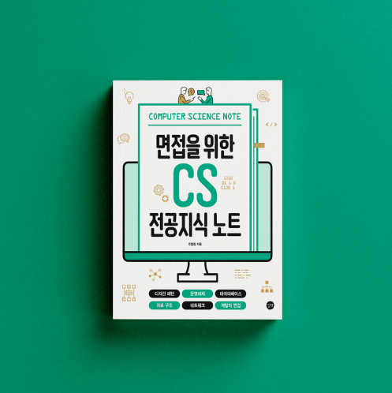

# 개발자 북클럽 - 면접을 위한 CS 전공지식 노트

> 2023.01.08부터 2023.02.26까지 6주 간 진행되는 '면접을 위한 CS 전공지식 노트' 스터디입니다.  
> 디자인 패턴, 네트워크, 운영체제, 데이터베이스, 자료 구조 등 CS(Computer Science) 전공지식을 학습합니다.

 

 

# 📒 진행 방식

- **매주 일요일 오후 3시** 스터디 진행한다.
- **토요일 오후 12시**까지 '발표가 가능할 수준'까지 학습하며 학습 자료 PR 남긴다.
- 스터디 당일, 모든 팀원이 돌아가며 학습 내용 발표한다.
  - 이해가 잘 되지 않는 부분이나 질문이 있다면 함께 피드백
  - 발표 및 피드백이 끝난 팀원의 PR은 merge
- 발표가 모두 종료되었다면 다음 스터디에서의 학습할 양과 담당자 정하고 스터디를 마친다.

 

# 🚩 스터디 참여 체크

스터디 참여는 2가지가 체크됩니다.

1. 학습자료를 마감시간 전까지 작성했는가?
2. 스터디 당일에 참석하고 발표를 진행했는가?

 

# 📅 일정

| 일정  |       날짜       |      범위       | 완료여부 |                 참여자                 | 발표자 |
| :---: | :--------------: | :-------------: | :------: | :------------------------------------: | :----: |
| 0주차 | 01.08 (일) 15:00 |       OT        |    ✅    | 김다영, 박진희, 이도원, 한승주, 한윤호 |        |
| 1주차 | 01.15 (일) 15:00 |  1장 (p.15~66)  |          |                                        |        |
| 2주차 | 01.29 (일) 15:00 | 2장 (p.67~132)  |          |                                        |        |
| 3주차 | 02.05 (일) 25:00 | 3장 (p.133~182) |          |                                        |        |
| 4주차 | 02.12 (일) 15:00 | 4장 (p.183~230) |          |                                        |        |
| 5주차 | 02.19 (일) 15:00 | 5장 (p.231~262) |          |                                        |        |
| 6주차 | 02.26 (일) 15:00 | 6장 (p.263~285) |          |                                        |        |

 

# 🙋‍♀ 스터디 멤버

[김다영](https://github.com/lizzykim)

 

[박진희](https://github.com/JJinne)

 

[이도원](https://github.com/2dowon)

 

[한승주](https://github.com/hansjoo24)

 

[한윤호](https://github.com/HanYounho)

 
